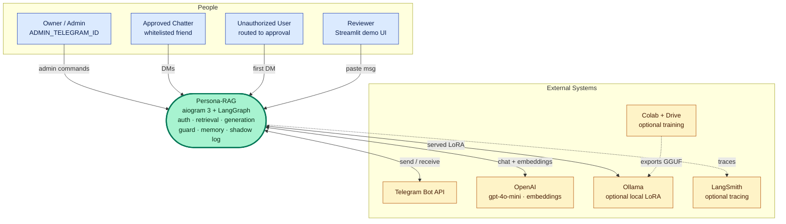
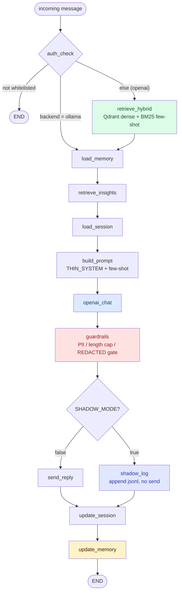

# Contributing to Persona-RAG

This guide is for a contributor or an AI coding agent making a change to the codebase. It maps the package, points to the exact file you edit for common changes, lists the quality gates, and records where design decisions live.

The package is `persona_rag`. The runtime is a LangGraph state machine: an incoming Telegram message flows through a fixed sequence of nodes (auth, retrieval, prompt build, generation, guardrails, send, memory update). Configuration is centralized in `persona_rag/config.py` as a single Pydantic `Settings` model.

## 1. Repo map

Each subsystem is a package under `persona_rag/`.

| Subsystem | Path | What lives there |
|-----------|------|------------------|
| Bot | `persona_rag/bot/` | aiogram entrypoint (`main.py`), auth (`auth.py`), rate limiting (`rate_limit.py`), FSM states (`states.py`), update `handlers/`, `debug_trace.py` |
| Graph | `persona_rag/graph/` | LangGraph assembly: `compile.py` builds the state machine, `state.py` defines `GraphState` |
| Graph nodes | `persona_rag/graph/nodes/` | One file per node: `auth_check`, `retrieve_hybrid`, `load_memory`, `retrieve_insights`, `load_session`, `build_prompt`, `openai_chat`, `guardrails`, `send_reply`, `shadow_log`, `update_session`, `update_memory` |
| Retrieval | `persona_rag/retrieval/` | Hybrid search: `dense.py`, `bm25.py`, fusion in `hybrid.py`, `mmr.py` reranking, `rerank.py` |
| Generate | `persona_rag/generate/` | Prompt assembly (`prompt.py`), persona anchor (`persona.py`), LLM call (`llm_client.py`), `guardrails.py`, `register.py`, `bubbles.py`, `select.py`, `ollama_health.py` |
| Insights | `persona_rag/insights/` | Self-insights distillation pipeline: `extractor.py`, `verifier.py`, `verification.py`, `consolidator.py`, `algo.py`, `recency.py`, `router.py`, `sessions.py`, `persistence.py`, `persona_description.py`, `onboarding.py`, plus `synonyms.yaml` and `onboarding_questions.yaml` |
| Ingest | `persona_rag/ingest/` | Chat-export parsing and cleaning: `telegram_parser.py`, `instagram_parser.py`, `conversation.py`, `turns.py`, `normalize.py`, `pii.py`, `stylometry.py`, `pipeline.py` |
| Index | `persona_rag/index/` | Vector and lexical stores: `qdrant_store.py`, `bm25_store.py`, `embedder.py`, `keys.py` |
| Eval | `persona_rag/eval/` | Voice scoring: `authorship.py`, `stylometry.py`, `distribution.py`, `mlflow_wrap.py` |
| Finetune | `persona_rag/finetune/` | LoRA training-data export: `dataset.py` |
| Memory | `persona_rag/memory/` | Per-user distilled memory: `store.py`, `updater.py` |
| Shadow | `persona_rag/shadow/` | Shadow-mode reply logging: `logger.py` |
| DB | `persona_rag/db/` | SQLModel persistence: `engine.py`, `models.py` |

### System context



### Per-message pipeline

The node order and the two branch points (`_route_after_auth`, `_route_after_guardrails`) are defined in `persona_rag/graph/compile.py`.



## 2. Where do I change ONE thing

| Goal | Edit |
|------|------|
| Add a graph node | Create the node file under `persona_rag/graph/nodes/`, then register it in `persona_rag/graph/compile.py`: add `g.add_node(...)` plus the `g.add_edge(...)` (or conditional edge) that wires it into the sequence. |
| Tune retrieval | The knobs live in `persona_rag/config.py` (`TOP_K`, `HYBRID_SCORE_FLOOR`, `HYBRID_DENSE_ALPHA`, `RECENCY_HALF_LIFE_DAYS`, `MMR_ENABLED`, `MMR_POOL_SIZE`, `MMR_LAMBDA`). The behavior lives in `persona_rag/retrieval/` (`hybrid.py`, `dense.py`, `bm25.py`, `mmr.py`, `rerank.py`). |
| Change a guardrail | Logic is in `persona_rag/generate/guardrails.py` (`apply_guardrails` handles `<REDACTED>` do-not-send, phone/email stripping, length truncation). The graph wrapper that calls it is `persona_rag/graph/nodes/guardrails.py`. |
| Add or adjust an insight stage | Work inside `persona_rag/insights/`. Extraction is `extractor.py`, verification is `verifier.py` / `verification.py`, consolidation is `consolidator.py`, algorithmic patterns are `algo.py`. Stage thresholds are `INSIGHTS_*` keys in `config.py`. |
| Change the persona system prompt | The voice anchor is `persona_rag/generate/persona.py` (`THIN_SYSTEM`). The full prompt assembly (`SYSTEM_TEMPLATE`, `build_messages`, `build_thin_messages`, register and shape directives) is `persona_rag/generate/prompt.py`. |
| Add a config knob | Add a field to the `Settings` class in `persona_rag/config.py`. It becomes overridable via env var or `.env`. |

## 3. Quality gates

Run these before opening a PR. All targets are defined in the `Makefile`.

| Command | What it runs |
|---------|--------------|
| `make lint` | `ruff check` and `ruff format --check` over `persona_rag tests scripts streamlit_app`. Ruff is configured strict in `pyproject.toml`: line length 100, rule sets `E, F, I, B, UP, SIM, RUF`. |
| `make type` | `mypy persona_rag`. mypy runs in `strict` mode with `warn_unreachable`, `disallow_untyped_defs`, and `disallow_incomplete_defs` (see `[tool.mypy]` in `pyproject.toml`). |
| `make test` | `pytest -v`. Async tests run under `pytest-asyncio` with `asyncio_mode = "auto"`. The suite has 72 Python test files under `tests/`. |
| `make format` | `ruff format` (writes changes) over the same paths as `make lint`. |

### pre-commit

The repo ships a `.pre-commit-config.yaml` with three hooks: `ruff --fix`, `ruff-format`, and `mypy --strict` (pinned ruff `v0.6.9`, mypy `v1.11.2`). Install the hooks once with `make hooks` (`uv run pre-commit install`). The mypy hook runs with `pass_filenames: false` and targets the `persona_rag` package, matching `make type`.

## 4. The Colab notebook is a generated artifact

`notebooks/finetune_persona_colab.ipynb` is generated, not hand-edited. The generator is `scripts/build_colab_notebook.py`. Edit the cell sources in that script, then regenerate:

```
uv run python scripts/build_colab_notebook.py
```

`tests/test_colab_notebook_in_sync.py` is the sync guard. It imports the generator, calls `build_notebook()`, and asserts the committed `.ipynb` equals the generator output. If you change the script without regenerating and committing the notebook, this test fails. The `THIN_SYSTEM` anchor string in the generator must stay byte-identical to `persona_rag.generate.persona.THIN_SYSTEM` so training and serving share the same persona prompt.

## 5. Design notes

Design rationale lives next to the code: module docstrings (for example `persona_rag/retrieval/mmr.py` and `persona_rag/insights/verifier.py`) and the deep-dive docs under `docs/` explain why each subsystem is shaped the way it is. Read the relevant doc or docstring before changing a subsystem it covers.
