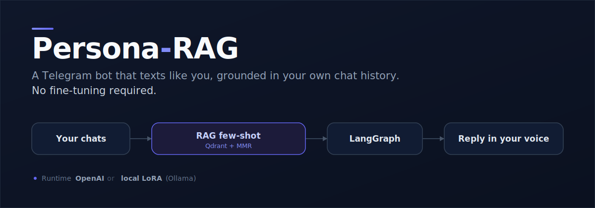
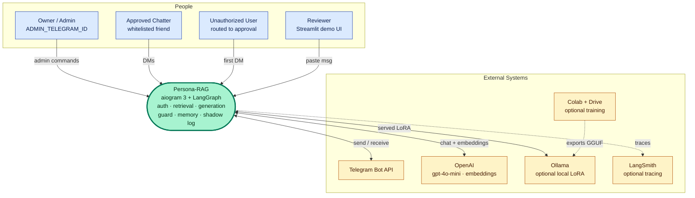

# Persona-RAG

[](https://github.com/BohdanChuprynka/Persona-RAG/actions/workflows/ci.yml)
[](https://www.python.org/)
[](LICENSE)

Persona-RAG is a LangGraph-orchestrated retrieval-augmented Telegram bot that replies in your voice, grounded in your own exported chat history. You feed it your Telegram and Instagram exports, it indexes them into Qdrant, and approved friends can DM a persona that talks like you. The persona transfer works without fine-tuning: the model sees your real past replies as retrieved few-shot examples. An optional path serves a locally fine-tuned LoRA via Ollama for higher lexical voice fidelity, with the same Telegram pipeline driving either backend.

## Highlights

- **Persona transfer without fine-tuning.** Retrieved past replies act as few-shot examples, so a base model (`gpt-4o-mini` by default) speaks in your register without an SFT run.
- **Runtime backend swap.** The `--local` flag points the generate node at a locally-served fine-tuned LoRA through Ollama's OpenAI-compatible API instead of OpenAI. The adapter trains on a thin prompt shape and serves under that exact shape, so train equals serve byte-for-byte (`THIN_SYSTEM` in `persona_rag/generate/persona.py` is imported by both the export and the serving path).
- **Distributional voice evaluation.** `scripts/eval_persona.py` scores the distance between your real replies and the bot's across stylometric distributions: message shape, per-bubble length, opener variety, script mix, and paren-smiley rate.
- **Hybrid retrieval.** Dense vectors plus BM25, fused and then reranked with Maximal Marginal Relevance (MMR) and recency decay. Config keys: `HYBRID_DENSE_ALPHA`, `MMR_ENABLED`, `MMR_LAMBDA`, `RECENCY_HALF_LIFE_DAYS`, `HYBRID_SCORE_FLOOR`.
- **Cost-bounded self-insights pipeline.** A multi-stage extract-verify-consolidate pass distills durable facts about you from your history, gated by an evidence threshold, a distinct-partner check, and a hard USD budget cap (`INSIGHTS_BUDGET_HARD_CAP_USD`).
- **Engineering hygiene.** 72 Python test files, `ruff` lint and format, `mypy --strict`, pre-commit hooks, and a docker-compose stack for Qdrant and MLflow.

## How it works

A LangGraph state machine handles every incoming message: auth check (whitelist or route to admin approval), hybrid retrieval of similar past replies, prompt assembly, generation, post-generation guardrails (PII redaction, length cap), and burst-style delivery that splits replies into multiple Telegram bubbles with a human-like typing delay. Per-user memory is distilled on an interval so the bot carries contact-specific context across sessions. A shadow mode logs each `incoming` message and the bot's `generated_reply` to a JSONL file without sending, leaving a `your_actual_reply` slot to fill in for offline A/B comparison.



## Quickstart

Prerequisites: Python 3.12+, [`uv`](https://docs.astral.sh/uv/), Docker with docker-compose, a Telegram bot token (from [@BotFather](https://t.me/BotFather)), your numeric Telegram user ID (DM [@userinfobot](https://t.me/userinfobot)), and an OpenAI API key. A LangSmith key is optional for tracing.

**1. Clone and configure.**

```bash
git clone https://github.com/<your-user>/Persona-RAG.git
cd Persona-RAG
uv sync
cp .env.example .env
# Fill in TELEGRAM_BOT_TOKEN, ADMIN_TELEGRAM_ID, OPENAI_API_KEY, PERSONA_NAME, etc.
```

**2. Export your chats.** From Telegram Desktop, Settings, Advanced, Export Telegram Data, personal chats only, machine-readable JSON. From Instagram, Settings, Your activity, Download your information, Messages only, JSON. Drop the exports into `data/raw/` (gitignored).

**3. Start backing services.**

```bash
docker-compose up -d qdrant mlflow
```

Qdrant listens on `localhost:6333`. The MLflow UI is on `localhost:5001` (the host-side mapping is `5001:5000` because macOS AirPlay holds port 5000).

**4. Ingest (one-time).**

```bash
uv run python scripts/ingest.py
```

Parses, PII-redacts, groups conversations, embeds, and writes to Qdrant.

**5. Run the bot.**

```bash
uv run python -m persona_rag.bot.main
```

The first DM from a non-admin triggers the admin approval flow in your Telegram.

**6. Optional: Streamlit demo and local LoRA.**

```bash
uv run streamlit run streamlit_app/main.py          # web demo at localhost:8501
make run-local                                       # serve a local LoRA via Ollama
```

`make run-local` runs `python -m persona_rag.bot.main --local`. The flag forces `GENERATION_BACKEND=ollama`, folds contact facts into the thin system turn, skips the few-shot retrieval node, and preflights the Ollama server at startup. Build the adapter first with the [fine-tune kit](docs/finetune/README.md).

## Documentation

| Doc | What |
|---|---|
| [`docs/ARCHITECTURE.md`](docs/ARCHITECTURE.md) | System overview, C4 containers, the three subsystems, why RAG over SFT, the OpenAI/Ollama backend swap |
| [`docs/runtime/REQUEST-PIPELINE.md`](docs/runtime/REQUEST-PIPELINE.md) | The per-message LangGraph path: 12 nodes, 2 branch points, `GraphState` keys, per-node contracts |
| [`docs/runtime/RETRIEVAL-AND-GENERATION.md`](docs/runtime/RETRIEVAL-AND-GENERATION.md) | Hybrid retrieval and MMR, the two prompt shapes, register/shape conditioning, decoding voice levers, best-of-N, bubble splitting |
| [`docs/DATA-PIPELINE.md`](docs/DATA-PIPELINE.md) | Ingest spec: parsers, PII redaction, conversation grouping, turn extraction, Qdrant and SQLite schema |
| [`docs/INSIGHTS.md`](docs/INSIGHTS.md) | Self-insights distillation: stages A–F, the verify gate, routing thresholds, and how insights reach the prompt |
| [`docs/AUTH-FLOW.md`](docs/AUTH-FLOW.md) | Owner-admin gated whitelist state machine, onboarding buffer, admin command set |
| [`docs/EVAL.md`](docs/EVAL.md) | Distributional stylometry, held-out splits, authorship cosine, shadow-mode A/B |
| [`docs/CONFIGURATION.md`](docs/CONFIGURATION.md) | Minimal `.env` to boot plus the full `Settings` reference grouped by subsystem |
| [`docs/OBSERVABILITY.md`](docs/OBSERVABILITY.md) | structlog conventions, LangSmith tracing, MLflow eval tracking, compose ports |
| [`docs/finetune/README.md`](docs/finetune/README.md) | Free-Colab LoRA kit, the train-equals-serve rule, the honest register target, Ollama serving |
| [`CONTRIBUTING.md`](CONTRIBUTING.md) | Repo map, where to change one thing, quality gates, the generated-notebook rule, design-decision history |

## Stack

Python 3.12, `uv`, aiogram 3 (bot), LangGraph (orchestration), LangSmith (tracing), OpenAI (LLM and embeddings), Ollama (optional local LoRA backend), Qdrant (vector DB, hybrid retrieval), MLflow (eval tracking), Streamlit (demo UI), SQLModel over SQLite (user state), pydantic-settings, structlog, tenacity, pytest with pytest-asyncio, ruff, mypy strict, pre-commit.

## Privacy

Chat data lives only in `data/`, which is gitignored. PII redaction (phone, email, address, IBAN, credit card, configurable friend names) runs at ingest time. On the default OpenAI backend, incoming and outgoing messages and retrieved snippets are sent to OpenAI for embedding and chat completion. The `--local` LoRA path keeps generation on your machine; insight lookup still embeds the incoming message via OpenAI unless you set `INSIGHTS_ENABLED=false`. LangSmith stores per-chain traces only when `LANGCHAIN_TRACING_V2=true`.

## License

MIT. See [`LICENSE`](LICENSE).

## CI

[`.github/workflows/ci.yml`](.github/workflows/ci.yml) runs `make lint`, `make type`, and `make test` on every push and pull request to `main`. Pushing a workflow file for the first time needs the `workflow` token scope (`gh auth refresh -s workflow`).
