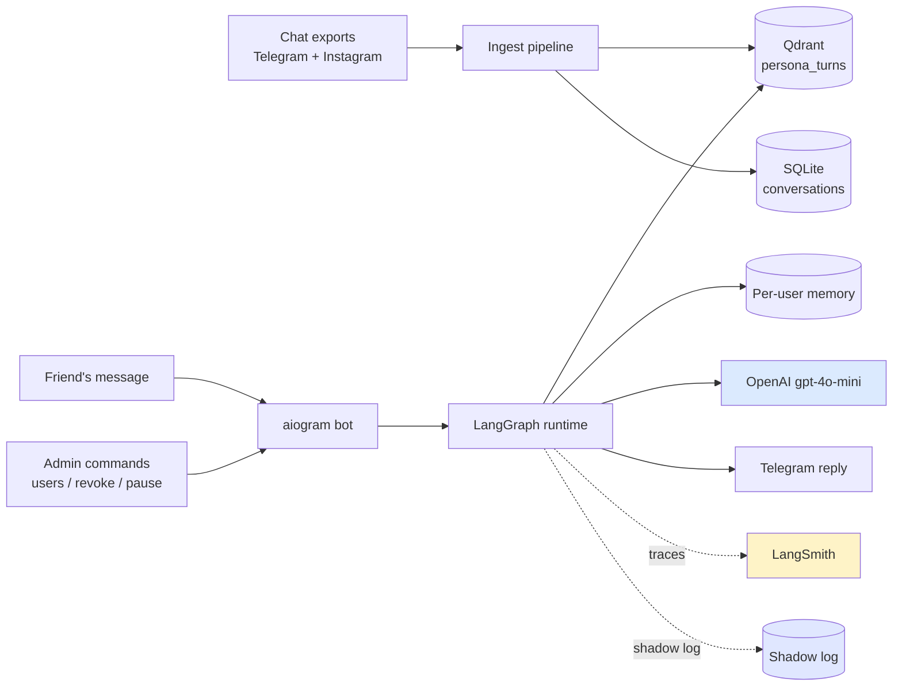
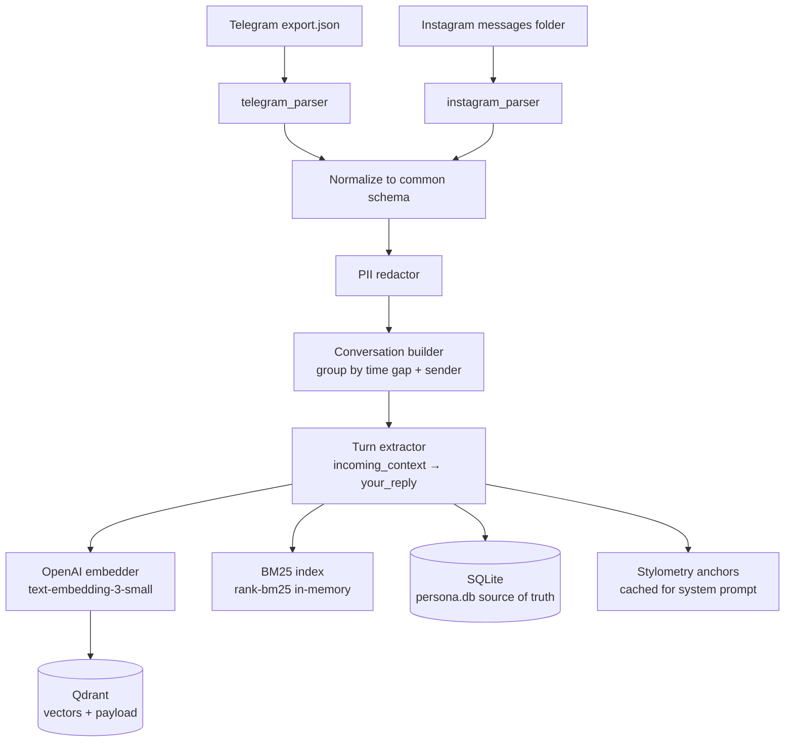
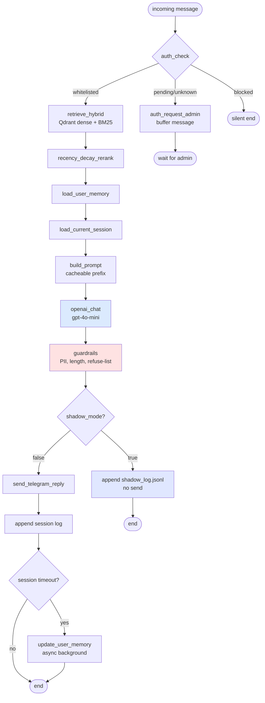
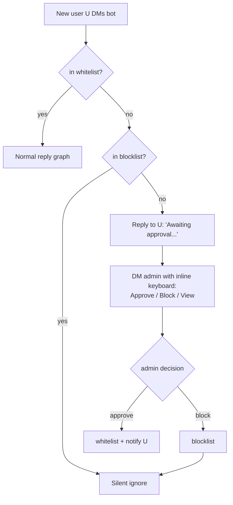

# Architecture

## TL;DR

Persona-RAG is a LangGraph-orchestrated retrieval-augmented Telegram bot. It indexes your past chats once into Qdrant, then at runtime walks a state machine that retrieves your most-similar past replies and asks gpt-4o-mini to generate a reply in your voice. Every chain is traced in LangSmith; every eval run is tracked in MLflow.

Three subsystems:

1. **Ingest** — batch, run once after dropping chat exports into `data/raw/`
2. **Runtime** — per-message LangGraph state machine, latency budget ~1–3s
3. **Auth** — owner-gated whitelist with admin-side approval inbox (a LangGraph node)



See [`diagrams/system.mmd`](diagrams/system.mmd) for the full render and [`diagrams/langgraph-state.mmd`](diagrams/langgraph-state.mmd) for the LangGraph node graph.

---

## Why RAG, not SFT

The predecessor project (`PersonaGPT`) attempted supervised fine-tuning of small open LLMs (Mistral-7B-Ukrainian, then DeepSeek-R1-Distill-Qwen-1.5B) on Q/A pairs extracted from chat history. Ranked failure modes:

1. **Augmentation destroyed the persona.** Back-translation, synonym swap, word shuffle erase exactly what you want to preserve: phrasing, slang, capitalization, emoji density.
2. **Reasoning-model base.** DeepSeek-R1-Distill emits `<think>...</think>` before answering. Fine-tuning didn't override the template.
3. **Loss mis-targeted.** `labels = outputs.input_ids` plus `DataCollatorForLanguageModeling` → loss computed over the prompt as well as the reply.
4. **Conversation model wrong.** Forced strict odd-row=question / even-row=answer alternation. Real chats are not turn-based; the rule discards or warps half the signal.
5. **LoRA undersized.** `r=8` with default `target_modules` touches `q_proj, v_proj` only.
6. **Eval wrong.** BLEU/ROUGE measure n-gram overlap with a single reference. Persona is a distribution.

**RAG sidesteps all of these.** The trade-off: dependence on a strong base model (OpenAI here) instead of owning weights. DPO post-training is a deferred Phase 2 — the shadow logger built into v1 captures the dataset that makes DPO possible later.

---

## Subsystem A — Ingest



**Unit of storage:** `PersonaTurn` — a single "your reply" event with metadata.

```python
class PersonaTurn:
    id: str                       # uuid
    your_reply: str               # raw, cased, emoji-preserved
    incoming_context: list[str]   # last N messages before your reply, in order
    channel: Literal["telegram", "instagram"]
    chat_id_hash: str
    recipient_id_hash: str
    timestamp: datetime
    language: str
    embedding: list[float]        # 1536-d for text-embedding-3-small
```

Stored in:
- **Qdrant** — `persona_turns` collection, vector + payload (the metadata). Used for dense retrieval.
- **SQLite** — full text source of truth. Used to (re-)build the BM25 index in memory at bot startup and for human inspection / audits.
- **Style anchors cache** — small JSON (avg length, emoji rate, top bigrams) computed once at ingest, read into the system prompt at runtime.

**Conversation grouping rule:** consecutive same-sender messages within 5 min collapse into one. Time gap > 6 hours opens a new conversation segment. Group chats (>2 participants) are dropped by default.

Full spec: [`DATA-PIPELINE.md`](DATA-PIPELINE.md).

---

## Subsystem B — Runtime (LangGraph state machine)

Every incoming message walks a deterministic graph:



Each box is a LangGraph node. The state object carries:

```python
class GraphState(TypedDict):
    incoming: str
    user_id: int
    auth_state: Literal["whitelisted", "pending", "blocked"]
    retrieved: list[PersonaTurn]
    memory: str
    session: list[Message]
    prompt: list[dict]
    reply: str
    shadow: bool
```

**Why LangGraph instead of plain Python functions:**

- The auth/pending/whitelisted branching is a natural conditional edge.
- The memory-update post-step is a fork that doesn't need to block the reply.
- Every node's input/output is automatically traced in LangSmith — you see exactly where time is spent and where errors originate.
- Checkpointing lets the bot recover mid-flow if a node crashes (relevant when LLM calls flake).
- Visual graph doubles as documentation.

**Latency budget (gpt-4o-mini, prompt caching enabled):**

| Node | Target |
|---|---|
| auth_check | <5ms (SQLite) |
| retrieve_hybrid | ~120ms (Qdrant + BM25) |
| rerank | <10ms |
| load_user_memory + session | <30ms |
| build_prompt | <20ms |
| openai_chat | 600–1800ms (with cache hit on prefix) |
| guardrails | <20ms |
| send | ~80ms (Telegram) |
| **Total** | **~1–2.5s** |

**Prompt-caching trick:** OpenAI auto-caches identical prompt prefixes ≥1024 tokens on `gpt-4o-mini`. Persona-RAG structures the prompt so the persona system prompt + style anchors + per-user memory summary form a stable prefix shared across turns within the same session. The dynamic (few-shot + session + new message) suffix is variable. Result: ~50% input cost reduction on multi-turn sessions. Details in [`PROMPT-DESIGN.md`](PROMPT-DESIGN.md).

---

## Subsystem C — Auth

Owner-only access by default. Implemented as a LangGraph branch on `auth_check`:



Admin commands: `/users`, `/revoke <user>`, `/block <user>`, `/pause`, `/resume`, `/stats`, `/memory <user>`, `/forget <user>`.

Full spec: [`AUTH-FLOW.md`](AUTH-FLOW.md).

---

## Per-user memory

Each authorized user gets a `UserMemory` row in SQLite. Stores a running LLM-distilled summary of what the persona has "learned" about them.

```python
class UserMemory:
    user_id: int
    summary: str                  # ≤300 tokens
    last_interaction: datetime
    updated_at: datetime
```

**Update trigger:** when the current session ends (silence > `SESSION_TIMEOUT_MINUTES`), the `update_user_memory` node runs asynchronously (doesn't block the reply that triggered the timeout). It asks the LLM to update `summary` given the just-ended session + previous summary. Cost: ~$0.0001 per update.

**At inference:** memory summary is injected into the system prompt as `## What you remember about this user`. Makes the prefix cacheable AND gives continuity across days.

---

## Shadow mode

When `SHADOW_MODE=true`, the bot generates replies internally but **does not send them**. Each turn writes a JSONL line to `data/shadow_log.jsonl`:

```json
{
  "ts": "2026-05-17T14:23:11Z",
  "user_id_hash": "...",
  "incoming": "...",
  "context": ["...", "..."],
  "retrieved_ids": ["uuid1", "uuid2"],
  "memory_summary": "...",
  "bot_reply": "...",
  "your_actual_reply": "..."    // backfilled later from Telegram export
}
```

Purpose:
1. **A/B eval against ground truth** — see `EVAL.md`.
2. **Future DPO dataset** — `(prompt, chosen=your_actual, rejected=bot_reply)` pairs once enough triples accumulate.

Shadow mode is the bridge to a future on-device fine-tuned model without committing to that path now.

---

## Stack rationale

| Layer | Choice | Why |
|---|---|---|
| Bot framework | `aiogram 3` | Async-first, modern handler model, FSM helpers |
| Orchestration | **LangGraph** | Stateful graph matches auth+retrieve+gen flow; native LangSmith tracing; checkpoint recovery |
| LLM observability | **LangSmith** | LLM-native traces (chains, retrievals, latencies); free tier |
| Embeddings | OpenAI `text-embedding-3-small` | Cheap, multilingual, no local model to ship |
| Vector DB | **Qdrant** | Production-grade, hybrid (dense + payload-filter); docker-compose locally, cloud later |
| Lexical retrieval | `rank-bm25` | Tiny dep, in-memory BM25; hybrid alongside dense |
| LLM | OpenAI `gpt-4o-mini` | Cheap + fast + good multilingual; `gpt-4o` for higher quality via env |
| User DB | SQLite + SQLModel | Whitelist, blocklist, memory, audit log; tiny ops |
| Config | pydantic-settings | Typed, .env-driven, no secrets in repo |
| Eval tracking | **MLflow** | Versioned eval runs with params + metrics + artifacts |
| Demo UI | **Streamlit** | Web-side preview surface; mirrors Policy RAG pattern |
| Logging | `structlog` | Structured JSON logs; queryable later |
| Tests | pytest + pytest-asyncio | Bot handlers + retrieval + graph nodes |
| Quality | ruff + mypy strict + pre-commit | Discipline signal; catches errors before runtime |
| Pkg | `uv` | Fast, lockfile, modern |
| Container | Docker + docker-compose | Reproducible local dev; ship-ready story |

**Explicitly avoided:**
- **OpenTelemetry** — single-process bot doesn't benefit from generic distributed tracing. LangSmith is purpose-built and covers what matters.
- **HuggingFace cross-encoder reranker** — premature optimization. gpt-4o-mini tolerates noisy retrievals well. Add only if eval shows retrieval is the bottleneck.
- **FastAPI admin surface** — duplicates Telegram admin commands. Stats can be queried via MLflow UI + `/stats` Telegram command.
- **n8n** — single-purpose service; visual workflow adds latency + indirection without benefit.
- **24/7 deploy** — project runs locally on owner's machine when wanted.
- **RAGAS** — measures faithfulness to retrieved docs. Persona-RAG doesn't want faithful regurgitation; it wants stylistic continuation. Wrong instrument.

---

## Future extensions (not v1)

- **DPO post-training (Phase 2).** Once shadow log has ≥1k labeled triples, DPO a small open base (Qwen2.5-7B-Instruct) on `(prompt, chosen=your_actual, rejected=bot_reply)` pairs. Result: a tuned model that prefers your voice. Pluggable into `generate/llm_client.py`.
- **Local LLM swap.** Replace OpenAI with Ollama for full privacy. Touch points: `generate/llm_client.py`, embeddings via `nomic-embed-text` or `bge-m3`.
- **Per-recipient style.** Currently one persona for all friends. Shard by recipient (you text differently with mom vs friends).
- **HF cross-encoder reranker.** Add only if eval flags retrieval quality as the bottleneck.
- **Multi-source ingest.** Discord, iMessage, SMS parsers. Same `PersonaTurn` schema.
