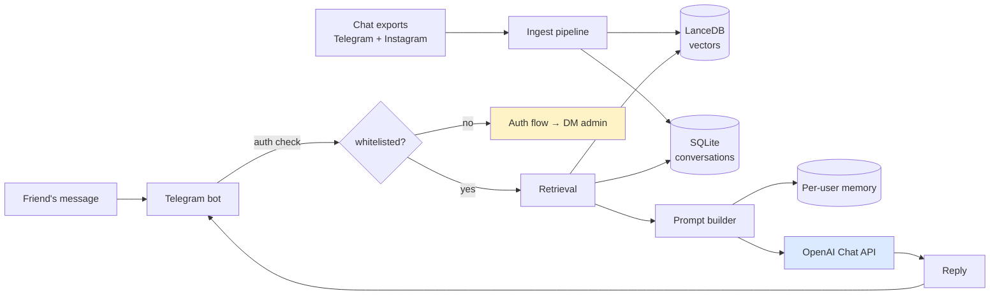
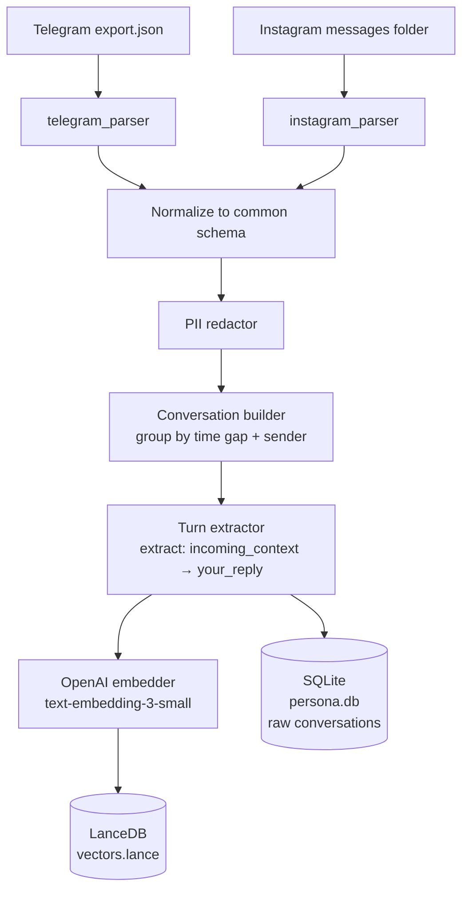
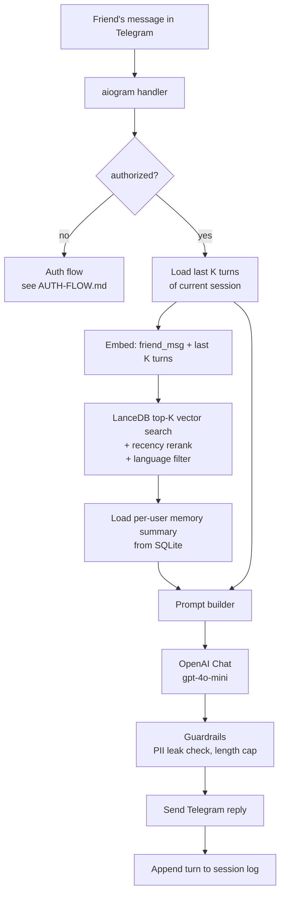
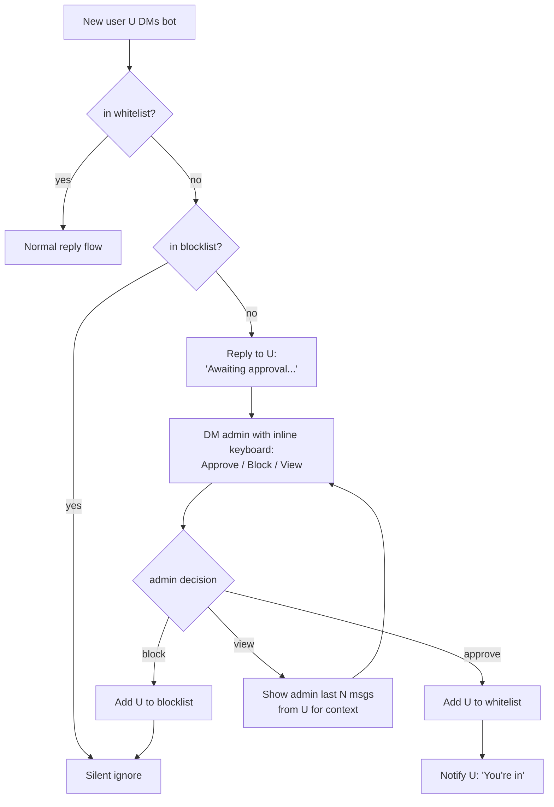

# Architecture

## TL;DR

Persona-RAG is a retrieval-augmented Telegram bot. It indexes your past chats once, then at runtime retrieves your most-similar past replies and asks an LLM to generate a reply in your voice using those retrievals as few-shot examples.

Three independent subsystems:

1. **Ingest** — batch, run once after dropping chat exports into `data/raw/`
2. **Runtime** — per-message, latency budget ~1–3s
3. **Auth** — owner-gated whitelist with admin-side approval inbox



See [`diagrams/system.mmd`](diagrams/system.mmd) for the full render.

---

## Why RAG, not SFT

The predecessor project (`PersonaGPT`) attempted supervised fine-tuning of small open LLMs (Mistral-7B-Ukrainian, then DeepSeek-R1-Distill-Qwen-1.5B) on Q/A pairs extracted from chat history. The failure modes ranked by damage:

1. **Augmentation destroyed the persona.** Back-translation, synonym swap, word shuffle are NLP-classification tricks. They erase exactly what you want to preserve: phrasing, slang, capitalization, emoji density.
2. **Reasoning-model base.** DeepSeek-R1-Distill emits `<think>...</think>` before answering. Fine-tuning didn't override the template — model still output internal monologue in inference.
3. **Loss mis-targeted.** `labels = outputs.input_ids` plus `DataCollatorForLanguageModeling` → loss computed over the prompt as well as the reply. Half the gradient teaches the model to memorize the persona prompt.
4. **Conversation model wrong.** `structure_dataset` forced strict odd-row=question / even-row=answer alternation. Real chats are not turn-based; the rule discards or warps half the signal.
5. **LoRA undersized.** `r=8` with default `target_modules` touches `q_proj, v_proj` only (~0.1% of params). Style imprinting needs `r=32–64` across all linear layers.
6. **Eval wrong.** BLEU/ROUGE measure n-gram overlap with a single reference. Persona is a distribution — needs perplexity-on-held-out-self, stylometric features, human A/B.

**RAG sidesteps all of these.** No augmentation, no fine-tuning, no loss masking, no template leakage. The model literally sees your past replies as few-shot examples and copies the register. The trade-off: you depend on a strong base model (OpenAI here) instead of owning weights.

---

## Subsystem A — Ingest



**Unit of storage:** `PersonaTurn` — a single "your reply" event with metadata.

```python
class PersonaTurn:
    id: str                       # uuid
    your_reply: str               # raw, cased, emoji-preserved
    incoming_context: list[str]   # last N messages before your reply, in order
    channel: Literal["telegram", "instagram"]
    chat_id: str                  # source convo identifier (hashed)
    recipient_id: str             # hashed
    timestamp: datetime
    language: str                 # detected, ISO 639-1
    embedding: list[float]        # 1536-d for text-embedding-3-small
```

**Conversation grouping rule:** consecutive same-sender messages within 5 min collapse into one. Time gap > 6 hours opens a new conversation segment. Group chats (>2 participants) are dropped — too noisy for persona signal.

**Why both DBs?** LanceDB stores embeddings + minimal metadata for fast vector search. SQLite stores the full conversation text and is the source of truth for human inspection, reindex, and PII audits.

Full spec: [`DATA-PIPELINE.md`](DATA-PIPELINE.md).

---

## Subsystem B — Runtime



**Latency budget (gpt-4o-mini target):**

| Step | Target |
|---|---|
| Embed query | ~100ms |
| LanceDB top-K | <50ms |
| Load user memory | <20ms |
| OpenAI completion | 800–2000ms |
| **Total** | **~1–3s** |

**Retrieval ranking:** cosine similarity, then rerank with `score * exp(-age_days / RECENCY_HALF_LIFE_DAYS)`. Boosts recent persona drift over old style.

**Prompt budget (gpt-4o-mini context window: 128k):** ~3k tokens for prompt is comfortable. Persona system + 8 few-shot turn pairs + last 10 session turns + memory summary fits easily.

Full spec: [`PROMPT-DESIGN.md`](PROMPT-DESIGN.md).

---

## Subsystem C — Auth

Owner-only access by default. Any new user has to be approved by admin (the bot owner) before getting a single reply.



Admin commands: `/users`, `/revoke <user>`, `/block <user>`, `/pause`, `/resume`, `/stats`.

Full spec: [`AUTH-FLOW.md`](AUTH-FLOW.md).

---

## Per-user memory

Each authorized user gets a memory record in SQLite. Stores a running summary of what the persona has "learned" about them.

```python
class UserMemory:
    user_id: int                  # Telegram user id
    summary: str                  # LLM-distilled facts + topics, ≤300 tokens
    last_interaction: datetime
    updated_at: datetime
```

**Update trigger:** when the current session ends (silence > `SESSION_TIMEOUT_MINUTES`), a background task asks the LLM to update `summary` based on the just-ended conversation. The new summary replaces the old.

**At inference:** memory summary is injected into the system prompt as `## What you remember about this user`. Lets the bot maintain continuity across days without exploding the context.

---

## Stack rationale

| Layer | Choice | Why |
|---|---|---|
| Bot framework | `aiogram 3` | Async-first, modern handler model, native FSM for auth flow |
| Embeddings | OpenAI `text-embedding-3-small` | Cheap (~$0.02/1M tokens), multilingual, no local model to ship |
| Vector DB | LanceDB | Embedded, on-disk, zero ops, single-file deploy |
| LLM | OpenAI `gpt-4o-mini` | Cheap + fast + good multilingual; `gpt-4o` for higher quality via env |
| User DB | SQLite + SQLModel | Whitelist, blocklist, memory, audit log; tiny ops |
| Config | pydantic-settings | Typed, .env-driven, no secrets in repo |
| Tests | pytest + pytest-asyncio | Bot handlers + retrieval pipeline |
| Pkg | `uv` | Fast, lockfile, modern |

**Explicitly avoided:**
- **n8n** — Single-purpose service; visual workflow adds latency + indirection without benefit. The auth FSM is cleaner in aiogram (purpose-built). Revisit if extensibility (Notion logging, cron eval) becomes a need.
- **24/7 deploy** — Project runs locally on owner's machine when wanted. No Docker/VPS/Fly. Removes 90% of ops surface.
- **Fine-tuning** — See "Why RAG, not SFT" above.

---

## Future extensions (not v1)

- **Local LLM swap** — replace OpenAI with Ollama (Qwen2.5-32B / Llama-3.3-70B) for full privacy. Needs Mac with 32GB+ RAM or a GPU. Touch points: `generate/llm_client.py`, `index/embedder.py`.
- **DPO post-training** — once you have logged enough (bot_reply, your_actual_reply) pairs from shadow mode, DPO a small base model to sharpen the persona. See `EVAL.md`.
- **Per-recipient style** — currently one persona for all friends. Could shard by recipient (you text differently with mom vs friends).
- **Multi-source ingest** — add Discord, iMessage, SMS parsers. Same `PersonaTurn` schema.
- **Web frontend** — public demo where anyone can chat with the persona without Telegram. Behind a separate auth.
