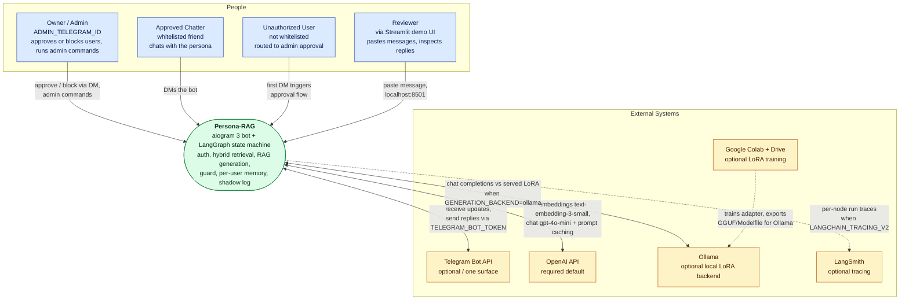
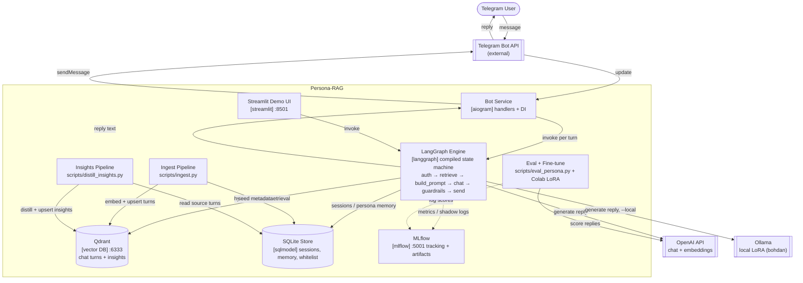

# Architecture

This is the architecture home for Persona-RAG. It explains what the system is, how it decomposes into containers and subsystems, the request pipeline, why the design retrieves instead of fine-tunes, and how the generation backend swaps between OpenAI and a local LoRA.

## System overview

Persona-RAG is a Telegram bot that answers in the owner's voice. It indexes the owner's past chats once into Qdrant, then for each incoming message walks a compiled LangGraph state machine (`persona_rag/graph/compile.py`) that authorizes the sender, retrieves the most-similar past replies plus distilled self-insights, builds a prompt, generates a reply, runs guardrails, and sends it back. Per-node runs trace to LangSmith when `LANGCHAIN_TRACING_V2` is set; offline eval runs track to MLflow.

The runtime has three layers of grounding, applied in order by the request graph:

- **Few-shot turns** from `persona_rag/retrieval` (hybrid dense + BM25 over the `persona_turns` Qdrant collection).
- **Self-insights** from `persona_rag/insights` (the `self_insights` Qdrant collection).
- **Per-user memory** from SQLite (`persona_rag/memory`, stored at `data/persona.db`).

Generation defaults to OpenAI `gpt-4o-mini`. Setting `GENERATION_BACKEND=ollama` (or passing `--local` to the bot) points the generate node at a locally-served Qwen2.5-3B LoRA through Ollama's OpenAI-compatible API.

## C4 model

### L1: System context

The L1 diagram above sets the boundary. Telegram is one surface (the Streamlit demo UI is another), OpenAI is the required default for embeddings and chat, and Ollama, Colab, and LangSmith are optional.

### L2: Container

Inside the boundary, the bot service (`persona_rag/bot`) receives Telegram updates and invokes the compiled graph once per turn. The same graph backs the Streamlit demo. Two batch pipelines (ingest and insights) write the stores. Eval and fine-tune run offline.

Container reference:

| Container | Path | Role |
|---|---|---|
| Bot service | `persona_rag/bot/` | aiogram 3 handlers, DI, admin commands, `--local` flag |
| LangGraph engine | `persona_rag/graph/` | compiled per-turn state machine |
| Demo UI | `streamlit_app/main.py`, port 8501 | paste-a-message preview over the same graph |
| Qdrant | port 6333 | `persona_turns` and `self_insights` collections |
| SQLite store | `data/persona.db` (`persona_rag/db`, `persona_rag/memory`) | whitelist, blocklist, sessions, per-user memory |
| MLflow | `MLFLOW_TRACKING_URI` (`file:./mlruns`), UI port 5001 | offline eval runs |
| Ingest pipeline | `scripts/ingest.py` (`persona_rag/ingest`, `persona_rag/index`) | parse exports, embed, upsert turns |
| Insights pipeline | `scripts/distill_insights.py` (`persona_rag/insights`) | distill and upsert self-insights |
| Eval + fine-tune | `scripts/eval_persona.py`, `persona_rag/finetune`, Colab kit | offline scoring and LoRA training |

## The three subsystems

### Offline ingest

Batch, run once after dropping chat exports into `data/raw/`. Driven by `scripts/ingest.py` over `persona_rag/ingest` and `persona_rag/index`. It parses Telegram and Instagram exports into a common turn schema, redacts PII, groups messages into conversations, extracts `incoming_context -> your_reply` turns, embeds them with `text-embedding-3-small`, and upserts to the `persona_turns` Qdrant collection plus the SQLite source of truth. Conversation grouping is tuned by `MESSAGE_BURST_SECONDS`, `SESSION_BREAK_HOURS`, `MIN_SESSION_TURNS`, `CONTEXT_TURNS`, and `INCLUDE_GROUP_CHATS` in `persona_rag/config.py`. Full spec: [`DATA-PIPELINE.md`](DATA-PIPELINE.md).

### Online request graph

Per-message, the compiled LangGraph state machine in `persona_rag/graph/compile.py`. Nodes live under `persona_rag/graph/nodes/`. The shared state is `GraphState` in `persona_rag/graph/state.py`, carrying `incoming`, `user_id`, `chat_id`, `session_id`, `auth_state`, `retrieved`, `memory`, `insights`, `session`, `style_anchors_json`, `prompt`, `reply`, and `shadow`. See the pipeline overview below.

### Offline self-insights

Batch, run after ingest. Driven by `scripts/distill_insights.py` over `persona_rag/insights`, gated by `INSIGHTS_ENABLED`. It reads source turns from SQLite, extracts candidate facts about the owner with `INSIGHTS_EXTRACT_MODEL` (`gpt-4o`), verifies them with `INSIGHTS_VERIFY_MODEL`, consolidates with `INSIGHTS_CONSOLIDATE_MODEL`, and upserts confirmed insights to the `self_insights` Qdrant collection (`QDRANT_INSIGHTS_COLLECTION`). At runtime the `retrieve_insights` node pulls the top matches into the prompt. Confidence and evidence gates (`INSIGHTS_CONFIDENCE_THRESHOLD`, `INSIGHTS_MIN_EVIDENCE`, `INSIGHTS_MIN_DISTINCT_PARTNERS`) keep weak facts out, and a hard budget cap (`INSIGHTS_BUDGET_HARD_CAP_USD`) bounds extraction cost.

## Request pipeline (12 nodes)

`build_graph()` in `persona_rag/graph/compile.py` registers twelve nodes. The entry point is `auth_check`; two conditional edges branch the flow.

| # | Node | Module under `persona_rag/graph/nodes/` | Role |
|---|---|---|---|
| 1 | `auth_check` | `auth_check.py` | Resolve sender state; non-whitelisted senders route to `END`. |
| 2 | `retrieve_hybrid` | `retrieve_hybrid.py` | Hybrid dense + BM25 few-shot retrieval (OpenAI path only). |
| 3 | `load_memory` | `load_memory.py` | Load per-user memory summary from SQLite. |
| 4 | `retrieve_insights` | `retrieve_insights.py` | Pull top self-insights from `self_insights`. |
| 5 | `load_session` | `load_session.py` | Load the current conversation window. |
| 6 | `build_prompt` | `build_prompt.py` | Assemble the prompt (cacheable prefix on the OpenAI path; thin shape on the LoRA path). |
| 7 | `openai_chat` | `openai_chat.py` | Generate the reply via the configured backend. |
| 8 | `guardrails` | `guardrails.py` | PII, length, and refuse-list checks. |
| 9 | `send_reply` | `send_reply.py` | Send Telegram reply bubbles (skipped in shadow mode). |
| 10 | `shadow_log` | `shadow_log.py` | Append a JSONL line instead of sending when `SHADOW_MODE`. |
| 11 | `update_session` | `update_session.py` | Append the turn to the session log. |
| 12 | `update_memory` | `update_memory.py` | Distill the per-user memory summary, then `END`. |

Two routers control the branches. `_route_after_auth` sends non-whitelisted senders to `END`; on the OpenAI backend it enters at `retrieve_hybrid`, and on the Ollama backend it skips few-shot retrieval and enters at `load_memory` (the LoRA serves the thin prompt and never injects retrieved few-shot turns, so `retrieve_hybrid` would be dead weight and the only per-message OpenAI embedding call). `_route_after_guardrails` sends to `shadow_log` when `SHADOW_MODE` is set, otherwise to `send_reply`.

For the depth treatment of each node (inputs, outputs, latency, failure handling), see [`runtime/REQUEST-PIPELINE.md`](runtime/REQUEST-PIPELINE.md). Prompt assembly and caching are in [`runtime/RETRIEVAL-AND-GENERATION.md`](runtime/RETRIEVAL-AND-GENERATION.md); the approval branch is in [`AUTH-FLOW.md`](AUTH-FLOW.md).

## Why RAG, not SFT

The predecessor project (`PersonaGPT`) attempted supervised fine-tuning of small open LLMs (Mistral-7B-Ukrainian, then DeepSeek-R1-Distill-Qwen-1.5B) on Q/A pairs extracted from chat history. Ranked failure modes:

1. **Augmentation destroyed the persona.** Back-translation, synonym swap, and word shuffle erase exactly what the system wants to preserve: phrasing, slang, capitalization, emoji density.
2. **Reasoning-model base.** DeepSeek-R1-Distill emits `<think>...</think>` before answering. Fine-tuning did not override the template.
3. **Loss mis-targeted.** `labels = outputs.input_ids` plus `DataCollatorForLanguageModeling` computed loss over the prompt as well as the reply.
4. **Conversation model wrong.** A strict odd-row-question / even-row-answer alternation was forced. Real chats are not turn-based, so the rule discarded or warped half the signal.
5. **LoRA undersized.** `r=8` with default `target_modules` touches `q_proj, v_proj` only.
6. **Eval wrong.** BLEU and ROUGE measure n-gram overlap with a single reference. Persona is a distribution.

RAG sidesteps all six. The trade-off is dependence on a strong base model (OpenAI by default) rather than owning weights. The local LoRA backend below reopens the owned-weights path without re-introducing these failure modes, because the adapter trains and serves on the same thin shape and the distributional eval in [`EVAL.md`](EVAL.md) replaces BLEU/ROUGE.

## Runtime backend swap

Generation is backend-pluggable through one config key, `GENERATION_BACKEND` in `persona_rag/config.py`.

| Backend | Trigger | Generation | Embeddings / insights |
|---|---|---|---|
| OpenAI (default) | `GENERATION_BACKEND=openai` | `gpt-4o-mini` (`OPENAI_CHAT_MODEL`) | OpenAI |
| Ollama (local LoRA) | `GENERATION_BACKEND=ollama`, or bot flag `--local` | Qwen2.5-3B LoRA served as `bohdan` (`OLLAMA_MODEL`) at `OLLAMA_BASE_URL` (`http://localhost:11434/v1`) | OpenAI |

Passing `--local` to `persona_rag/bot/main.py` sets `GENERATION_BACKEND=ollama` and waits for Ollama to be ready before starting. Embeddings and insights stay on OpenAI in both modes.

**train == serve.** The LoRA is trained on a single thin system turn, defined once as `THIN_SYSTEM` in `persona_rag/generate/persona.py` and reused by `persona_rag/finetune/dataset.py`, `scripts/export_finetune_data.py`, and `scripts/build_colab_notebook.py`. At serving time `build_messages` in `persona_rag/generate/prompt.py` detects the Ollama backend and calls `build_thin_messages`, reproducing the exact shape the adapter trained on: the `THIN_SYSTEM` turn plus one user turn holding the joined recent context, with no heavy template and no retrieved few-shot assistant turns (those would break the `train_on_responses_only` single-assistant-turn mask). Setting `OLLAMA_FACTS_IN_SYSTEM=true` folds a short facts addendum (contact memory plus bio insights) into the system turn, trading a little train/serve fidelity for RAG facts. The decoding voice levers `PAREN_LOGIT_BIAS` and `EXCLAIM_LOGIT_BIAS` apply on the OpenAI path only; the LoRA learned those habits from the data.

## Quality and testing

The repo carries 66 `test_*.py` modules under `tests/` (72 Python files in total), covering bot handlers, retrieval, graph nodes, the insights pipeline, generation, and eval. Quality gates are ruff, mypy strict, and pre-commit.

## Future extensions

- **Per-recipient style.** One persona serves all friends today. Shard retrieval and generation by recipient.
- **Cross-encoder reranker.** Add a HuggingFace cross-encoder only if eval flags retrieval quality as the bottleneck. The current reranker is MMR (`MMR_ENABLED`, `MMR_LAMBDA`, `MMR_POOL_SIZE`).
- **Multi-source ingest.** Discord, iMessage, and SMS parsers on the same turn schema.
- **DPO post-training.** The shadow log (`data/shadow_log.jsonl`, written when `SHADOW_MODE`) captures `(prompt, your_actual, bot_reply)` triples that make DPO on the local base possible later.

## Related docs

- [`runtime/REQUEST-PIPELINE.md`](runtime/REQUEST-PIPELINE.md): per-node request pipeline depth.
- [`runtime/RETRIEVAL-AND-GENERATION.md`](runtime/RETRIEVAL-AND-GENERATION.md): hybrid retrieval, the two prompt shapes, and decoding voice levers.
- [`DATA-PIPELINE.md`](DATA-PIPELINE.md): ingest spec and turn schema.
- [`INSIGHTS.md`](INSIGHTS.md): self-insights distillation pipeline.
- [`AUTH-FLOW.md`](AUTH-FLOW.md): approval and admin commands.
- [`EVAL.md`](EVAL.md): distributional eval and MLflow tracking.
- [`OBSERVABILITY.md`](OBSERVABILITY.md): LangSmith tracing and logs.
- [`finetune/README.md`](finetune/README.md): Colab LoRA kit.
- Diagram sources: [`diagrams/system.mmd`](diagrams/system.mmd), [`diagrams/c4-container.mmd`](diagrams/c4-container.mmd), [`diagrams/runtime.mmd`](diagrams/runtime.mmd), [`diagrams/langgraph-state.mmd`](diagrams/langgraph-state.mmd), [`diagrams/auth-flow.mmd`](diagrams/auth-flow.mmd), [`diagrams/ingest.mmd`](diagrams/ingest.mmd), [`diagrams/insights.mmd`](diagrams/insights.mmd).
