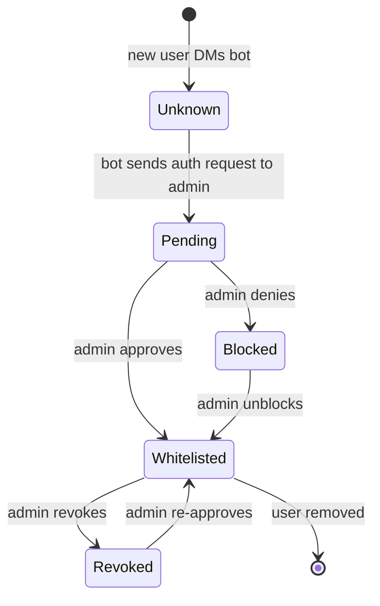
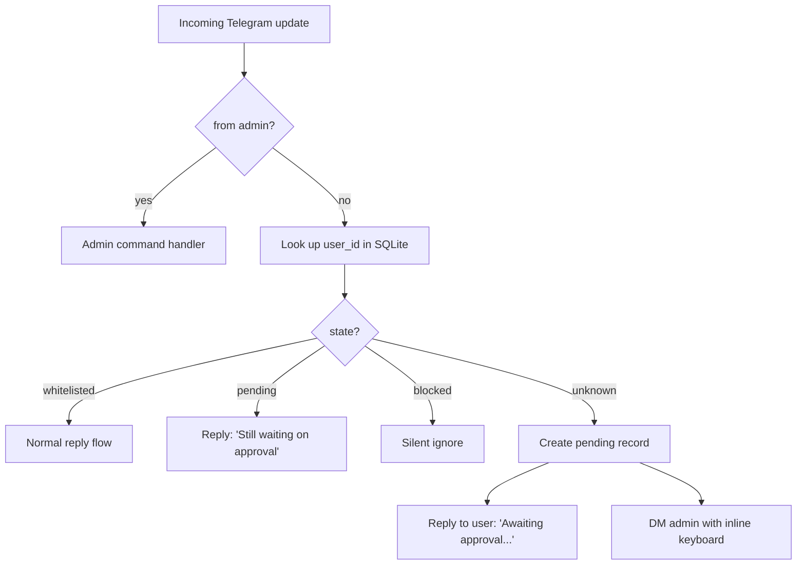

# Auth Flow

The bot is single-owner. Any user except the admin must be explicitly approved before getting a single reply.

## States



## On incoming message



## Admin notification

When a new user first DMs the bot, admin gets:

```
🔐 New user request

User: @username (id: 123456789)
Name: First Last
Language code: uk
First message:
> Hey, is this Bohdan?

[Approve]  [Block]  [View 5 more msgs]
```

Inline keyboard handlers:

- **Approve** → set state to `whitelisted`, reply to the requester: "✅ You're in. I'm online."
- **Block** → set state to `blocked`, no reply to requester.
- **View 5 more** → bot sends admin the next 5 buffered messages from this requester for richer context, then re-shows the keyboard.

While pending, the requester's messages are buffered (up to `PENDING_BUFFER_SIZE`, default 10) so admin can see what they actually wanted.

## Admin commands

| Command | Effect |
|---|---|
| `/users` | List all whitelisted users, last interaction time |
| `/pending` | List users awaiting approval |
| `/blocked` | List blocked users |
| `/revoke <user>` | Move user from whitelist back to blocked |
| `/block <user>` | Force-block (works from any state) |
| `/unblock <user>` | Move from blocked to unknown (re-enables auth request) |
| `/pause` | Globally pause bot — all incoming messages get "Bot is offline" reply |
| `/resume` | Resume |
| `/stats` | Show total users, replies sent, today's volume, token cost |
| `/memory <user>` | Show what the bot "remembers" about a user (memory summary) |
| `/forget <user>` | Clear per-user memory for a user |

All commands accept either `@username` or numeric user id.

## State storage

```sql
CREATE TABLE users (
    telegram_id INTEGER PRIMARY KEY,
    username TEXT,
    first_name TEXT,
    state TEXT NOT NULL,           -- 'unknown' | 'pending' | 'whitelisted' | 'blocked'
    first_seen DATETIME NOT NULL,
    last_interaction DATETIME,
    approved_by INTEGER,           -- always admin's id
    approved_at DATETIME,
    notes TEXT                     -- admin's free-text notes
);

CREATE TABLE pending_messages (
    id INTEGER PRIMARY KEY,
    user_id INTEGER REFERENCES users(telegram_id),
    text TEXT NOT NULL,
    timestamp DATETIME NOT NULL
);

CREATE TABLE audit_log (
    id INTEGER PRIMARY KEY,
    timestamp DATETIME NOT NULL,
    actor_id INTEGER NOT NULL,     -- admin's id
    action TEXT NOT NULL,          -- 'approve', 'block', 'revoke', etc.
    target_id INTEGER,             -- user acted on
    details TEXT
);
```

## aiogram FSM (admin side) + LangGraph branch (bot side)

Two concerns, two mechanisms:

- **Admin's approval flow** uses an aiogram FSM (`AuthApproval` group with `waiting_for_decision`, `viewing_more` states). Lives entirely in the admin's chat with the bot. States persist in aiogram's default in-memory storage; SQLite's `users` table is the source of truth for restart recovery.
- **Bot's per-message routing** is the `auth_check` node in the runtime LangGraph (see [`ARCHITECTURE.md`](ARCHITECTURE.md#subsystem-b--runtime-langgraph-state-machine)). It reads `users.state` for the sender and routes to one of: `retrieve_hybrid` (whitelisted), `auth_request_admin` (unknown), reply-with-pending (pending), silent-end (blocked).

The LangGraph routing is stateless per message — every call re-reads SQLite. No graph checkpoint state needed for auth itself.

```python
class AuthApproval(StatesGroup):
    waiting_for_decision = State()
    viewing_more = State()
```

If the bot restarts mid-approval, the pending record in SQLite is the source of truth — admin fires `/pending` to see open requests.

## Failure modes considered

| Failure | Handling |
|---|---|
| Admin DMs the bot themselves | Bypass all auth. Admin always gets full chat. |
| Two users DM the bot at the same time | Each gets their own auth request to admin. Admin handles serially via inline keyboards. |
| Admin doesn't respond for days | Pending users stay pending. They're silently buffered. They can `/cancel` to clear their own pending record. |
| User blocks the bot then unblocks | State stays whitelisted. No re-auth needed unless admin manually `/revoke`d. |
| Bot restarts mid-conversation | aiogram state lost; SQLite state intact. Whitelisted users continue normally. Pending users may need to resend (admin re-fires `/pending`). |
| Admin's user id changes (rare) | Manual SQL update. Document in `DEPLOY.md` (future). |

## Rate limiting

Per-user limit: `MAX_MESSAGES_PER_MINUTE` (default 6). Excess get queued (max 10), then dropped with a polite "slow down" reply.

Per-bot limit: `MAX_OPENAI_RPS` (default 2). Prevents accidental cost spikes if a user spams. Implemented via `tenacity` + token-bucket.

## Privacy notes

- Admin sees every authorized user's full session (it's the bot's chat log, after all).
- Per-user memory summaries can contain sensitive info the user shared with the persona. Admin should treat them as private — `/memory` only renders in admin DM, never elsewhere.
- `/forget <user>` is the user-deletion mechanism. Wipes their `UserMemory` row + audit-logs the deletion.
