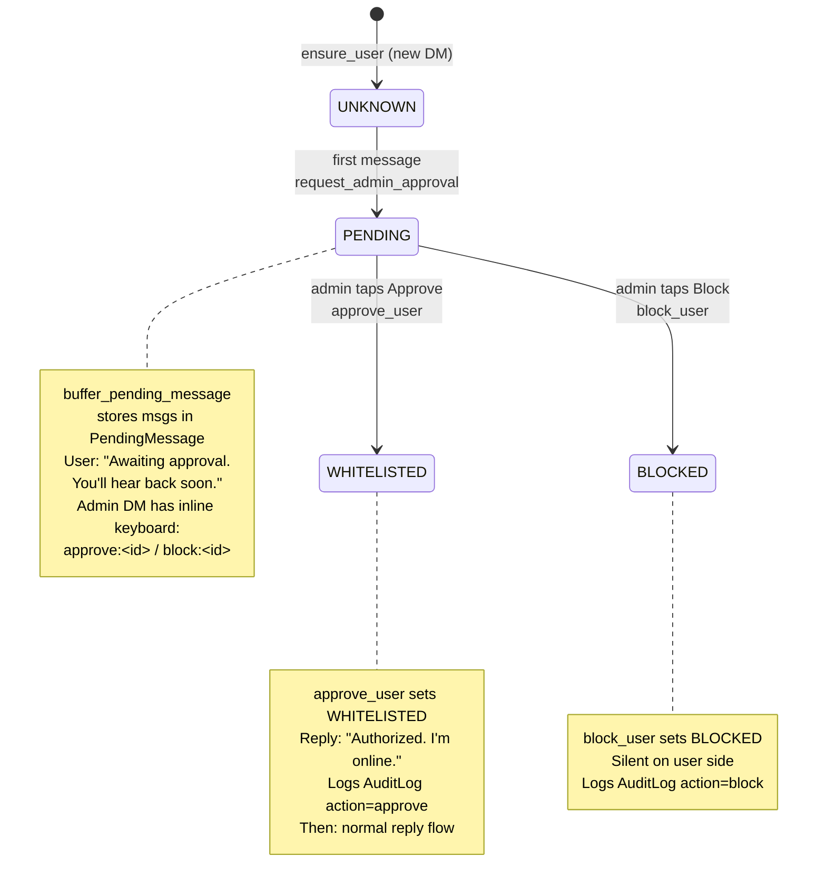
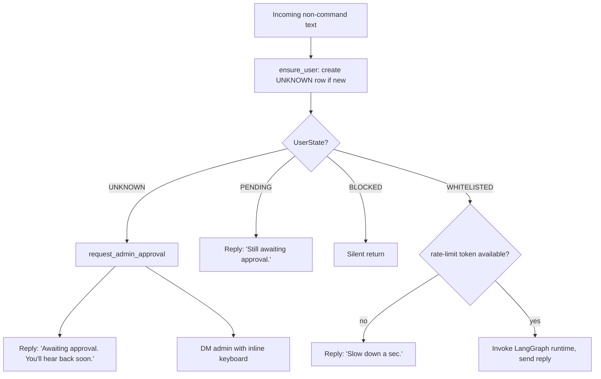

# Auth Flow

The bot is single-owner. One admin (`ADMIN_TELEGRAM_ID`) has full access. Every other Telegram user must be explicitly approved by the admin before the bot will generate a reply.

This document is the security-boundary reference: the whitelist state machine, the onboarding buffer, the admin approval keyboard, and the admin command set. Claims here are grounded in `persona_rag/bot/auth.py`, `persona_rag/bot/handlers/onboarding.py`, `persona_rag/bot/handlers/chat.py`, `persona_rag/bot/handlers/admin.py`, `persona_rag/bot/states.py`, and `persona_rag/models.py`.

## States

The whitelist state lives in `UserState` (`persona_rag/models.py`), a `str`-valued `Enum` with exactly four members:

| Enum member | Stored value | Meaning |
|---|---|---|
| `UserState.UNKNOWN` | `"unknown"` | First contact, or no row in the `User` table. |
| `UserState.PENDING` | `"pending"` | Sent a message, awaiting an admin decision. |
| `UserState.WHITELISTED` | `"whitelisted"` | Approved. Gets normal reply flow. |
| `UserState.BLOCKED` | `"blocked"` | Denied. Silently ignored. |

The persisted column is the `.value` string (see `set_user_state` and `approve_user` in `auth.py`), and reads reconstruct the enum with `UserState(u.state)`.



## On incoming message

The gate runs in `on_message` (`persona_rag/bot/handlers/chat.py`), which catches every non-command text message. It calls `ensure_user(...)`, which creates an `UNKNOWN` row on first contact and returns the current `UserState`. Routing is a direct branch on that state, before any graph work:

| State returned | Action |
|---|---|
| `UNKNOWN` | `request_admin_approval(...)`, then return. |
| `PENDING` | Reply "Still awaiting approval.", then return. |
| `BLOCKED` | Return with no reply (silent ignore). |
| `WHITELISTED` | Check the rate-limit bucket, then invoke the LangGraph runtime. |



The whitelist gate is enforced in the aiogram handler, ahead of the graph. The runtime LangGraph also models an `auth_check` node conceptually (see [`ARCHITECTURE.md`](ARCHITECTURE.md#request-pipeline-12-nodes)); the live access decision for an incoming DM is made by `on_message` reading SQLite via `ensure_user`. That read is stateless per message: every call re-reads the `User` row, so no graph checkpoint is needed for auth itself.

## Onboarding buffer and admin approval

`request_admin_approval` (`onboarding.py`) runs when an `UNKNOWN` user first messages the bot. It does three things:

1. `set_user_state(user.id, UserState.PENDING)`.
2. `buffer_pending_message(user.id, message.text or "")`: appends a `PendingMessage` row so the admin can see what the requester actually wanted.
3. Replies to the requester: `"Awaiting approval. You'll hear back soon."`, then DMs the admin a request card with an inline keyboard.

The admin DM is built by `request_admin_approval` and reads:

```
🔐 New user request
User: @username (id=123456789)
Name: First Last
First msg:
> <their first message>
```

The inline keyboard (`_admin_kb`) has two buttons. Callback data encodes the target user id:

| Button | Callback data | Handler | Effect |
|---|---|---|---|
| ✅ Approve | `approve:<id>` | `cb_approve` | `approve_user(...)`, edits the card to "Approved `<id>`.", DMs the requester "✅ Authorized. I'm online." |
| 🚫 Block | `block:<id>` | `cb_block` | `block_user(...)`, edits the card to "Blocked `<id>`.", no message to the requester. |

Both callback handlers first check `cb.from_user.id == ADMIN_TELEGRAM_ID` and answer "Not admin." for anyone else, so the buttons are inert for non-admins even if the callback is replayed.

`buffer_pending_message` has no size cap in code. The `PENDING_BUFFER_SIZE` setting (default 10) exists in `config.py` but is not read by the buffering path; treat the buffer as unbounded per pending user until that setting is wired.

## State storage

State and audit live in SQLModel tables in `persona_rag/db/models.py`. The relevant tables:

```python
class User(SQLModel, table=True):
    telegram_id: int = Field(primary_key=True)
    username: str | None = None
    first_name: str | None = None
    state: str
    first_seen: datetime
    last_interaction: datetime | None = None
    approved_by: int | None = None
    approved_at: datetime | None = None
    notes: str | None = None


class PendingMessage(SQLModel, table=True):
    id: int | None = Field(default=None, primary_key=True)
    user_id: int = Field(foreign_key="user.telegram_id")
    text: str
    timestamp: datetime


class AuditLog(SQLModel, table=True):
    id: int | None = Field(default=None, primary_key=True)
    timestamp: datetime
    actor_id: int
    action: str
    target_id: int | None = None
    details: str | None = None
```

`User.state` stores the `UserState` value string. `approve_user` sets `approved_by` to the admin id and `approved_at` to the approval time. The DB file path is `USER_DB_PATH` (default `data/persona.db`), configured in `persona_rag/config.py`.

### Audit log

Only two write paths create `AuditLog` rows today:

- `approve_user` writes `action="approve"` with `actor_id=admin_id`, `target_id=<user>`.
- `block_user` writes `action="block"` with the same shape.

`set_user_state` (the low-level mutator) does not itself audit; it is used by `block_user` (which adds the audit row) and by `request_admin_approval` to move a user to `PENDING`.

## Admin commands

All admin handlers live in `persona_rag/bot/handlers/admin.py`. Every handler returns early unless `message.from_user.id == ADMIN_TELEGRAM_ID`, so non-admins get no response. The argument-taking commands accept a numeric `telegram_id` only (they call `int(parts[1])` and reply "Invalid id." on failure); `@username` is not parsed.

### Whitelist commands

| Command | Effect |
|---|---|
| `/users` | List whitelisted users with id and last-interaction time. |
| `/pending` | List users in `PENDING` (via `get_pending`). |
| `/approve <telegram_id>` | `approve_user(...)`: move to `WHITELISTED`, audit, reply "Approved `<id>`." |
| `/block <telegram_id>` | `block_user(...)`: move to `BLOCKED`, audit, reply "Blocked `<id>`." |
| `/debug [me\|<uid>]` | Dump the most recent graph trace (retrieval scores, system-prompt header, reply) for a user. |

There is no `/unblock`, `/revoke`, `/blocked`, `/pause`, `/resume`, or `/stats` handler in the code. To revert a block, the admin re-approves with `/approve <id>` or taps Approve on a fresh request card. `block_user` works from any current state because it calls `set_user_state` unconditionally.

### Insights commands

The insights review surface is wired and admin-gated. These commands operate on the `InsightRow` table and the Qdrant collection named by `QDRANT_INSIGHTS_COLLECTION` (default `self_insights`):

| Command | Effect |
|---|---|
| `/insights verify` | Start an inline review session; render the next pending insight with a Yes / Fix / No / Skip / Stop keyboard. |
| `/insights_onboarding` | Begin the phase-2 question flow (loads `INSIGHTS_ONBOARDING_PATH` or the bundled `onboarding_questions.yaml`). |
| `/insights_stats` | Counts of insights by source, review status, and category. |
| `/insights_search <query>` | Embed the query and return the top semantic matches from the insights collection. |
| `/insights_delete <insight_id>` | Mark an insight `rejected`. |
| `/insights_show <insight_id>` | Render one insight row in full (category, source, confidence, evidence, dates). |

The `/insights verify` keyboard fires callbacks prefixed `insights:` (handled by `handle_insights_callback`), which is also admin-gated by id check.

## aiogram FSM (declared, not wired)

`persona_rag/bot/states.py` declares an aiogram FSM group:

```python
class AuthApproval(StatesGroup):
    waiting_for_decision = State()
    viewing_more = State()
```

`AuthApproval` and its two states are not referenced anywhere outside `states.py`. The live approval flow is stateless: it runs on callback-data-encoded user ids (`approve:<id>` / `block:<id>`) plus the SQLite `User` row, with no FSM transitions. Treat `AuthApproval` as a placeholder for a future multi-step admin flow (for example, a "view more buffered messages" step), not as a mechanism the current path depends on.

## Restart recovery

aiogram's default storage is in-memory, but the auth path does not depend on it. The `User` table is the source of truth. After a restart:

- Whitelisted users continue normally (their row is read fresh on the next message).
- Pending users stay `PENDING`; the admin runs `/pending` to see open requests and `/approve <id>` to clear them.
- An open request card from before the restart still works, because its buttons carry the target id in callback data and the handlers re-read SQLite.

## Rate limiting

Per-user throttling is a `TokenBucket` (`persona_rag/bot/rate_limit.py`) instantiated in `chat.py` at `rate_per_minute=MAX_MESSAGES_PER_MINUTE` (default 6). A whitelisted user whose bucket is empty gets "Slow down a sec." and the message is dropped. There is no queue and no per-message backoff in this path.

`MAX_OPENAI_RPS` (default 2) is declared in `config.py` but is not read by any module. Outbound OpenAI calls in `generate/llm_client.py` and `index/embedder.py` use `tenacity` retry with exponential backoff for transient failures; that is retry behavior, not a per-bot request-per-second cap. Do not document `MAX_OPENAI_RPS` as an enforced limit until it is wired.

## Privacy notes

- The admin sees every whitelisted user's full session; the bot's chat log is the admin's data.
- Per-contact memory is stored in the `ContactMemory` table (`persona_rag/db/models.py`, accessed via `persona_rag/memory/store.py`). There is no `/memory` or `/forget` admin command wired today, so memory inspection and per-user deletion are not exposed through the bot. Removal is a manual DB operation.

## Test coverage

The repository has 72 Python test files under `tests/`. The auth and onboarding boundary is exercised directly by `tests/test_bot_auth.py` (`ensure_user`, `approve_user`, `block_user`), `tests/test_bot_admin.py` (the admin commands), and `tests/test_bot_rate_limit.py` (the whitelisted-path `TokenBucket`).
