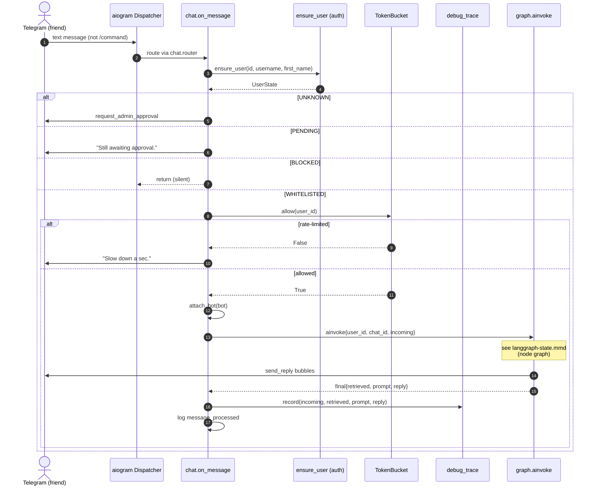

# Configuration

Every runtime setting lives in `persona_rag/config.py` as a field on the pydantic `Settings` model. Values are read from a `.env` file at the repo root (and from the process environment). `.env.example` is an annotated copy you fill in. Keys are case-sensitive, and any key not declared on the model is ignored.

Four settings have no default. The bot refuses to start until they are present. Everything else has a default baked into `config.py`, so a minimal `.env` only needs those four.

## Part 1: minimal `.env` to boot

These are the only fields declared without a default in `config.py`. Leaving any of them unset raises a validation error at startup.

```dotenv
# Persona identity shown in the system prompt
PERSONA_NAME=

# Telegram bot
TELEGRAM_BOT_TOKEN=
ADMIN_TELEGRAM_ID=

# OpenAI
OPENAI_API_KEY=
```

| Key | Type | Why it is required |
|-----|------|--------------------|
| `PERSONA_NAME` | str | The persona's name, injected into the system prompt. |
| `TELEGRAM_BOT_TOKEN` | str | Bot token from BotFather. No token, no bot. |
| `ADMIN_TELEGRAM_ID` | int | Your numeric Telegram user ID. This account is the admin (auth approvals, `/commands`) and the persona owner whose messages count as the reply side during ingest. |
| `OPENAI_API_KEY` | str | Used for response generation, embeddings, and the insights pipeline. Stays required even on the Ollama generation backend, because insight lookup still embeds through OpenAI. |

With those four set, run the bot:

```bash
make run          # uv run python -m persona_rag.bot.main
```

To serve a locally fine-tuned LoRA through Ollama instead of the OpenAI chat model:

```bash
make run-local    # uv run python -m persona_rag.bot.main --local
```

The `--local` flag sets `GENERATION_BACKEND=ollama` and `OLLAMA_FACTS_IN_SYSTEM=true` for that process and preflights the Ollama server. You can also set those keys in `.env` to make Ollama the permanent default (see the next section).

## Part 2: full settings reference

Grouped by subsystem. Each key shows the default from `config.py` and a one-line effect.

### Persona

| Key | Default | Effect |
|-----|---------|--------|
| `PERSONA_NAME` | (required) | Persona name in the system prompt. |
| `PERSONA_LANGUAGE` | `en` | Language hint for the persona. |
| `PERSONA_DESCRIPTION` | `""` | 1 to 3 sentence persona blurb pasted into the system prompt verbatim. Used as a fallback when generated persona descriptions are off or empty. |

### Telegram

| Key | Default | Effect |
|-----|---------|--------|
| `TELEGRAM_BOT_TOKEN` | (required) | BotFather token. |
| `ADMIN_TELEGRAM_ID` | (required) | Admin and persona-owner numeric user ID. |

### OpenAI

| Key | Default | Effect |
|-----|---------|--------|
| `OPENAI_API_KEY` | (required) | API key for generation, embeddings, and insights. |
| `OPENAI_CHAT_MODEL` | `gpt-4o-mini` | Chat model for response generation. Swap to `gpt-4o` for quality. |
| `OPENAI_EMBEDDING_MODEL` | `text-embedding-3-small` | Embedding model for retrieval and insight vectors. |

### Generation backend and Ollama

| Key | Default | Effect |
|-----|---------|--------|
| `GENERATION_BACKEND` | `openai` | `openai` calls the OpenAI chat model. `ollama` points the generate node at a locally served LoRA. |
| `OLLAMA_BASE_URL` | `http://localhost:11434/v1` | OpenAI-compatible endpoint of the local Ollama server. |
| `OLLAMA_MODEL` | `bohdan` | Ollama model name to serve. |
| `OLLAMA_FACTS_IN_SYSTEM` | `False` | When true, folds a short facts addendum (contact memory plus bio insights) into the thin system turn. Trades a little train/serve fidelity for RAG facts. |

### Qdrant

| Key | Default | Effect |
|-----|---------|--------|
| `QDRANT_URL` | `http://localhost:6333` | Vector DB URL. Local docker-compose default; use the cluster URL for Qdrant Cloud. |
| `QDRANT_API_KEY` | `None` | Empty for local docker-compose. Required for Qdrant Cloud. |
| `QDRANT_COLLECTION` | `persona_turns` | Collection holding ingested persona turns. |
| `QDRANT_INSIGHTS_COLLECTION` | `self_insights` | Collection holding extracted self-insights. |

### Retrieval

| Key | Default | Effect |
|-----|---------|--------|
| `TOP_K` | `4` | Number of past turns retrieved as few-shot examples. |
| `HYBRID_SCORE_FLOOR` | `0.15` | Drops retrieved turns below this final hybrid score. 0.0 disables. |
| `RECENCY_HALF_LIFE_DAYS` | `180` | Half-life for recency weighting of retrieved turns. |
| `HYBRID_DENSE_ALPHA` | `0.7` | Hybrid fusion weight (clamped 0.0 to 1.0). 1.0 is dense only, 0.0 is BM25 only. |
| `MMR_ENABLED` | `True` | Toggles Maximal Marginal Relevance reranking on the few-shot pool. |
| `MMR_POOL_SIZE` | `30` | Candidate pool size MMR reranks down to `TOP_K`. |
| `MMR_LAMBDA` | `0.6` | MMR relevance vs diversity tradeoff (clamped 0.0 to 1.0). 1.0 is pure relevance, 0.0 is pure diversity. |

### Generation and decoding levers

| Key | Default | Effect |
|-----|---------|--------|
| `MAX_REPLY_TOKENS` | `500` | Max tokens per generated reply. |
| `TEMPERATURE` | `0.8` | Sampling temperature for generation. |
| `ENABLE_PROMPT_CACHING` | `True` | Enables OpenAI automatic prompt caching on the system plus few-shot prefix. |
| `SHAPE_HINT_ENABLED` | `True` | Reads the typical message-count of the moment off retrieved replies and instructs the model to match it. |
| `REGISTER_AWARE_ENABLED` | `True` | Classifies the incoming message as heated, serious, or casual and adapts. Serious drops the brevity cap and injects an engagement directive. |
| `PAREN_LOGIT_BIAS` | `0` | Positive OpenAI logit bias on `)` / `))` tokens to nudge the paren-smiley tic. 0 is off. OpenAI backend only. |
| `EXCLAIM_LOGIT_BIAS` | `0` | Negative logit bias on `!` tokens to suppress the exclamation habit. 0 is off. OpenAI backend only. |
| `BEST_OF_N` | `1` | Samples N candidates and keeps the one closest to the style centroid (needs the authorship scorer). 1 is off. Multiplies generation token cost by N. |
| `BEST_OF_N_TEMPERATURE` | `1.0` | Sampling temperature used for the best-of-N candidate draws. |
| `REPLY_SPLIT_NEWLINES` | `True` | Splits the reply on `\n` and sends each fragment as its own Telegram message. Off keeps one bubble. |
| `REPLY_CHUNK_DELAY_BASE_MS` | `300` | Base typing delay between split message fragments. |
| `REPLY_CHUNK_DELAY_PER_CHAR_MS` | `20` | Per-character addition to the inter-fragment delay. |
| `REPLY_CHUNK_DELAY_MAX_MS` | `1800` | Cap on the inter-fragment delay. |
| `REPLY_CHUNK_DELAY_JITTER_PCT` | `0.5` | Random delay variance. 0.0 is deterministic, 0.5 is plus or minus 50 percent. Capped at 0.95 internally. |

### Memory and session

| Key | Default | Effect |
|-----|---------|--------|
| `CURRENT_SESSION_WINDOW` | `10` | Number of recent turns kept in the live conversation window. |
| `SESSION_TIMEOUT_MINUTES` | `30` | Idle gap that ends the current session. |
| `MEMORY_UPDATE_INTERVAL_TURNS` | `4` | Distill user memory every N completed user+assistant turns. 0 disables. |

### Ingest

| Key | Default | Effect |
|-----|---------|--------|
| `MESSAGE_BURST_SECONDS` | `300` | Consecutive same-sender messages inside this window collapse into one. |
| `SESSION_BREAK_HOURS` | `6` | Gap above this opens a new conversation session. |
| `MIN_SESSION_TURNS` | `4` | Sessions shorter than this are dropped. |
| `INCLUDE_GROUP_CHATS` | `False` | When false, drops chats with more than 2 participants. |
| `CONTEXT_TURNS` | `10` | Last N messages stored as incoming context per persona turn. |
| `PII_PATTERNS` | `phone,email,address,iban,credit_card` | Comma-separated PII categories to redact during ingest. |
| `PII_NAMES` | `""` | Extra literal names to redact. |
| `PII_REPLACE_TOKEN` | `<REDACTED>` | Token substituted for redacted spans. |
| `STRIP_URLS` | `False` | When true, removes URLs during ingest. |

### Insights

| Key | Default | Effect |
|-----|---------|--------|
| `INSIGHTS_ENABLED` | `True` | Master switch for the insights pipeline. |
| `INSIGHTS_EXTRACT_MODEL` | `gpt-4o` | Model that extracts raw insights from sessions. |
| `INSIGHTS_CONSOLIDATE_MODEL` | `gpt-4o-mini` | Model that consolidates raw insights. |
| `INSIGHTS_HISTORY_YEARS` | `2.5` | Only extract from sessions starting within the last N years. |
| `INSIGHTS_MIN_SESSION_TURNS` | `10` | Minimum turns for a session to be eligible for extraction. |
| `INSIGHTS_MIN_SESSION_CHARS` | `300` | Minimum character count for an eligible session. |
| `INSIGHTS_MAX_SESSIONS` | `600` | Cap on sessions fed into extraction. |
| `INSIGHTS_TOP_K_SEMANTIC` | `6` | Number of semantically retrieved insights at runtime. |
| `INSIGHTS_MIN_SCORE_FLOOR` | `0.2` | Drops retrieved insights below this recency-weighted score. 0.0 disables. |
| `INSIGHTS_TOP_N_STATIC` | `5` | Number of static (non-semantic) insights rendered into the prompt. |
| `INSIGHTS_CONFIDENCE_THRESHOLD` | `0.7` | Confidence cutoff for routing an insight. |
| `INSIGHTS_MIN_EVIDENCE` | `3` | Minimum evidence units to auto-promote an insight. |
| `INSIGHTS_MIN_DISTINCT_PARTNERS` | `2` | Evidence must come from at least N distinct chat partners. Counters single-thread misattribution. |
| `INSIGHTS_VERIFY_MODEL` | `gpt-4o-mini` | Model for the cheap per-insight verification audit. |
| `INSIGHTS_VERIFY_CONCURRENCY` | `10` | Concurrent verification calls. |
| `INSIGHTS_VERIFY_ENABLED` | `True` | Toggles the Stage C to D verification gate. |
| `INSIGHTS_AMBIGUOUS_EVIDENCE_WEIGHT` | `0.5` | Evidence weight assigned to an ambiguous verifier verdict. |
| `INSIGHTS_RECENCY_HALF_LIFE_DAYS` | `365` | Half-life for recency weighting of insights. |
| `INSIGHTS_STALE_DEMOTE_YEARS` | `2.0` | Age past which an insight is demoted as stale. |
| `INSIGHTS_STALE_DEMOTE_MIN_EVIDENCE` | `5` | Evidence below which a stale insight gets demoted. |
| `INSIGHTS_BUDGET_HARD_CAP_USD` | `5.0` | Hard USD cap on the insights extraction run. |
| `INSIGHTS_SYNONYMS_PATH` | `None` | Optional path overriding the bundled synonyms YAML. |
| `INSIGHTS_ONBOARDING_PATH` | `None` | Optional path overriding the bundled onboarding YAML. |
| `INSIGHTS_STATIC_PATTERNS_ENABLED` | `True` | Toggles static-pattern insight matching. |
| `INSIGHTS_PROMPT_TOP_ENTITIES` | `3` | Number of top entities surfaced in the prompt. |
| `INSIGHTS_USE_GENERATED_PERSONA_DESCRIPTION` | `True` | Build the persona description from verified plus onboarding insights, falling back to `PERSONA_DESCRIPTION` when empty. |

### Observability

| Key | Default | Effect |
|-----|---------|--------|
| `LANGCHAIN_TRACING_V2` | `True` | Enables LangSmith tracing for every LangGraph run. |
| `LANGCHAIN_API_KEY` | `None` | LangSmith API key. |
| `LANGCHAIN_PROJECT` | `persona-rag` | LangSmith project name. |
| `MLFLOW_TRACKING_URI` | `file:./mlruns` | MLflow tracking store. File-backed by default. |
| `MLFLOW_EXPERIMENT` | `persona-rag-eval` | MLflow experiment name for eval runs. |
| `USER_DB_PATH` | `data/persona.db` | SQLite path for user and session state. |
| `SHADOW_LOG_PATH` | `data/shadow_log.jsonl` | JSONL path for shadow-mode triples. |

### Shadow

| Key | Default | Effect |
|-----|---------|--------|
| `SHADOW_MODE` | `False` | When true, the bot generates replies but does not send them. Each (incoming, generated, actual reply) triple is logged to `SHADOW_LOG_PATH` for later dataset construction and evaluation. |

### Rate limits

| Key | Default | Effect |
|-----|---------|--------|
| `MAX_MESSAGES_PER_MINUTE` | `6` | Per-user message rate cap. |
| `MAX_OPENAI_RPS` | `2` | Cap on OpenAI requests per second. |
| `PENDING_BUFFER_SIZE` | `10` | Size of the pending-message buffer. |

## Where these values take effect

The diagram below (`docs/diagrams/runtime.mmd`) traces an inbound Telegram message through auth, the token-bucket rate limiter, and into the LangGraph run. Auth gating uses the Telegram identity, the rate limiter reads `MAX_MESSAGES_PER_MINUTE`, and the graph run consumes the retrieval, generation, and insights settings above.



## Verifying changes

Settings are loaded through a cached `get_settings()` and exercised across the test suite. The repo has 72 Python test files under `tests/`. Run them after changing config behavior:

```bash
make test         # uv run pytest -v
```
