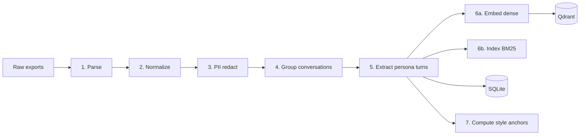

# Data Pipeline

End-to-end ingest: chat exports → parsed turns → PII-redacted → embedded → stored in Qdrant + SQLite.

## Inputs

| Source | Path convention | Format |
|---|---|---|
| Telegram | `data/raw/telegram/result.json` | Telegram Desktop "machine-readable JSON" export |
| Instagram | `data/raw/instagram/your_instagram_activity/messages/inbox/` | Instagram data download "messages JSON" |

Drop anywhere under `data/raw/`. Parsers auto-discover.

## Outputs

```
data/
├── persona.db                 # SQLite: conversations, turns, users, memory
├── style_anchors.json         # cached stylometric features for system prompt
└── shadow_log.jsonl           # populated only when SHADOW_MODE=true
```

Plus Qdrant collection `persona_turns` running in a separate process (docker-compose service).

## Stages



### 1. Parse

Per-source parsers in `persona_rag/ingest/`:

- `telegram_parser.py` — reads `result.json`, iterates `chats[].messages[]`. Skips service messages, polls, media without text.
- `instagram_parser.py` — walks `messages/inbox/*/message_*.json`, handles split-files. Decodes Latin-1 → UTF-8 (Instagram's known mojibake).

Both emit `RawMessage` records:

```python
class RawMessage:
    channel: Literal["telegram", "instagram"]
    chat_id: str
    sender_id: str
    sender_name: str
    text: str
    timestamp: datetime
    is_group: bool
```

### 2. Normalize

- Hash `chat_id`, `sender_id` with `BLAKE2b(key=PERSONA_NAME)` so SQLite doesn't store recipient identities in plaintext.
- Drop empty texts, edits, media-only messages.
- Detect language with `langdetect`; store as ISO 639-1.
- Drop group chats unless `INCLUDE_GROUP_CHATS=true`.

### 3. PII redact

Regex + word-list based. Configurable in `.env`:

```
PII_PATTERNS=phone,email,address,iban,credit_card
PII_NAMES=alice,bob,...
PII_REPLACE_TOKEN=<REDACTED>
STRIP_URLS=false
```

Rules applied in order: phones (E.164 + local), emails, URLs (optional), IBAN, credit-card-shaped digits, custom name list (case-insensitive whole-word). Not redacted: emojis, casing, punctuation quirks, slang — the persona signal.

Output stored both in SQLite (`messages.text`) and an in-memory copy used downstream. Original raw text never leaves `data/raw/`.

### 4. Group conversations

Within a single `chat_id`:

- Sort by `timestamp` ascending
- Collapse consecutive same-sender messages within `MESSAGE_BURST_SECONDS` (default 300)
- Cut into sessions wherever the gap exceeds `SESSION_BREAK_HOURS` (default 6)
- Drop sessions shorter than `MIN_SESSION_TURNS` (default 4)

### 5. Extract persona turns

For each session, walk forward and emit one `PersonaTurn` per "your reply" event:

```python
class PersonaTurn:
    id: str                          # uuid4
    your_reply: str                  # raw, cased, emoji-preserved
    incoming_context: list[str]      # last CONTEXT_TURNS messages (default 10)
    channel: Literal["telegram", "instagram"]
    chat_id_hash: str
    recipient_id_hash: str
    timestamp: datetime
    language: str
    your_reply_len_chars: int
    your_reply_emoji_count: int
    eval_split: bool                 # last 10% by time → eval=true, never retrieved
```

A "your reply" event = a message where `sender_id == ADMIN_TELEGRAM_ID`.

**Time-based eval split:** last 10% by `timestamp` go into `eval_split=true` and are excluded from retrieval. They are the held-out ground truth for `EVAL.md` metrics.

### 6a. Embed (dense)

- Batch-embed `your_reply` with `text-embedding-3-small`. Batch size 128.
- Use OpenAI batch API for cost if dataset > 100k turns.
- Write each `(PersonaTurn payload, vector)` row to Qdrant collection `persona_turns`.

Why embed `your_reply` instead of `incoming_context`? Retrieval target is "times I said something like this," not "times someone asked me something like this." The latter retrieves by topic; the former by response register. The former is closer to style transfer.

### 6b. Index (BM25 lexical)

- Build `rank-bm25.BM25Okapi` over the same `your_reply` corpus, tokenized with `language`-aware whitespace + punctuation split.
- Persist to `data/bm25.pkl`. Rebuilt only on full reindex.
- Loaded into memory at bot startup.

At retrieval time: dense top-2K from Qdrant + BM25 top-2K, fused with `score = HYBRID_DENSE_ALPHA * dense_norm + (1 - HYBRID_DENSE_ALPHA) * bm25_norm`. Default `HYBRID_DENSE_ALPHA=0.7`.

### 7. Compute style anchors

One-shot pass over the full `your_reply` corpus:

```json
{
  "avg_len_chars": 47,
  "median_len_chars": 28,
  "emoji_rate_per_char": 0.012,
  "lang_distribution": {"uk": 0.62, "en": 0.31, "ru": 0.07},
  "top_bigrams": ["ok cool", "yeah no", ...],
  "n_turns": 14823
}
```

Written to `data/style_anchors.json`. Loaded into system prompt at runtime. Static between ingests — part of the cacheable prefix.

## Qdrant collection schema

```python
qdrant_client.create_collection(
    collection_name="persona_turns",
    vectors_config=VectorParams(size=1536, distance=Distance.COSINE),
)
```

Payload:

```python
{
    "id": "uuid",
    "your_reply": "str",
    "incoming_context": ["str", ...],
    "channel": "telegram" | "instagram",
    "chat_id_hash": "str",
    "recipient_id_hash": "str",
    "timestamp": "iso8601",
    "language": "uk",
    "your_reply_len_chars": 47,
    "your_reply_emoji_count": 2,
    "eval_split": false,
}
```

Payload indices: `language` (keyword), `eval_split` (bool), `timestamp` (datetime). Used for filtered retrieval (e.g., same-language, exclude-eval-split).

## SQLite schema (SQLModel)

```sql
CREATE TABLE conversations (
    id INTEGER PRIMARY KEY,
    chat_id_hash TEXT NOT NULL,
    channel TEXT NOT NULL,
    started_at DATETIME NOT NULL,
    ended_at DATETIME NOT NULL,
    message_count INTEGER NOT NULL
);

CREATE TABLE messages (
    id INTEGER PRIMARY KEY,
    conversation_id INTEGER REFERENCES conversations(id),
    sender_id_hash TEXT NOT NULL,
    is_persona BOOLEAN NOT NULL,
    text TEXT NOT NULL,            -- PII-redacted
    timestamp DATETIME NOT NULL,
    language TEXT
);

CREATE TABLE persona_turns (
    id TEXT PRIMARY KEY,           -- uuid; matches Qdrant point id
    your_reply TEXT NOT NULL,
    incoming_context_json TEXT NOT NULL,
    channel TEXT NOT NULL,
    chat_id_hash TEXT NOT NULL,
    recipient_id_hash TEXT NOT NULL,
    timestamp DATETIME NOT NULL,
    language TEXT NOT NULL,
    your_reply_len_chars INTEGER,
    your_reply_emoji_count INTEGER,
    eval_split BOOLEAN NOT NULL DEFAULT 0
);
```

SQLite is the source of truth. Qdrant is the index. If they ever diverge: `scripts/reindex.py --wipe` rebuilds Qdrant from SQLite.

## Reproducibility

The pipeline is idempotent. Running `scripts/ingest.py` twice on the same input:

- Detects identical raw files by content hash and skips parse
- Re-runs PII redaction (cheap — schema may have evolved)
- Re-embeds only new turns (deduped by `PersonaTurn.id`)

To force a clean rebuild: `scripts/reindex.py --wipe`.

## Cost (OpenAI embeddings)

`text-embedding-3-small`: $0.02 per 1M tokens.

| Turns | Avg tokens/turn | Total tokens | Cost |
|---|---|---|---|
| 1,000 | 30 | 30k | $0.0006 |
| 10,000 | 30 | 300k | $0.006 |
| 100,000 | 30 | 3M | $0.06 |

Negligible. Inference token cost dominates the budget.
