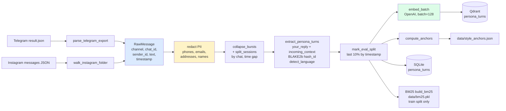

# Data Pipeline

End-to-end ingest: chat exports become parsed messages, get PII-redacted, are grouped into sessions, are turned into `PersonaTurn` records, then get embedded into Qdrant and written to SQLite. Entry point is `scripts/ingest.py`, which calls `run_ingest` in `persona_rag/ingest/pipeline.py`.

## Inputs

| Source | Default path | Format |
|---|---|---|
| Telegram | `data/raw/telegram/result.json` | Telegram Desktop machine-readable JSON export |
| Instagram | `data/raw/instagram` | Instagram data download, `messages/inbox/*/message_*.json` |

`scripts/ingest.py` flags:

| Flag | Effect |
|---|---|
| `--tg PATH` | Telegram export JSON (default `data/raw/telegram/result.json`) |
| `--ig PATH` | Instagram export root folder (default `data/raw/instagram`) |
| `--dry-run` | Skip embeddings. SQLite, style anchors, BM25, and the cost estimate still run. |
| `--estimate-only` | Parse, extract turns, print token/cost estimate. No DB write, no embeddings. |
| `--max-messages N` | Cap total raw messages parsed (safe first run on a huge export). |

A path that does not exist is passed as `None`, so a missing source is skipped rather than failing.

## Outputs

```
data/
├── persona.db                  # SQLite (USER_DB_PATH): conversations, messages, persona_turns, users, insights, ...
├── style_anchors.json          # cached stylometric features for the system prompt
├── bm25.pkl                    # pickled BM25Okapi index + the ids it covers
└── shadow_log.jsonl            # SHADOW_LOG_PATH, written only when SHADOW_MODE=true
```

Plus a Qdrant collection named by `QDRANT_COLLECTION` (default `persona_turns`), served on `http://localhost:6333` (`QDRANT_URL`).

## Stages

The diagram below is `docs/diagrams/ingest.mmd`.



### 1. Parse

Per-source parsers live in `persona_rag/ingest/`. Both emit `RawMessage` records (`persona_rag/models.py`):

```python
class RawMessage(BaseModel):
    channel: Literal["telegram", "instagram"]
    chat_id: str
    sender_id: str
    sender_name: str
    text: str
    timestamp: datetime
    is_group: bool
```

`telegram_parser.py` (`parse_telegram_export`) reads `result.json` and iterates `chats.list[].messages[]`. It keeps only `type == "message"` records with non-empty text, so service messages and media without a caption are dropped. Formatted text arrives as a list of runs and is flattened by joining each run's `text`. `sender_id` comes from `from_id`, normalized by `_normalize_id`, which strips a `user` or `channel` prefix so the numeric body matches `ADMIN_TELEGRAM_ID`. A chat is a group unless its `type` is `personal_chat` or `private_supergroup`. Group chats are skipped unless `INCLUDE_GROUP_CHATS=true`.

`instagram_parser.py` (`walk_instagram_folder`) globs `message_*.json` under the export root and parses each via `parse_instagram_export`. `chat_id` is `thread_path`, falling back to `title`, then the file stem. A thread with more than two participants is a group and is skipped unless `INCLUDE_GROUP_CHATS=true`. Instagram encodes UTF-8 bytes as Latin-1 codepoints, so `_decode_mojibake` re-encodes Latin-1 then decodes UTF-8 to recover the original characters, applied to `sender_id`, `sender_name`, and `text`. Timestamps come from `timestamp_ms` in UTC.

### 2. Normalize

`persona_rag/ingest/normalize.py`:

- `hash_id` is a keyed BLAKE2b (`digest_size=8`, so 16 hex chars). The key is `PERSONA_NAME` truncated to 64 bytes. The same input hashes to the same value across runs, so SQLite and Qdrant never store recipient identities in plaintext.
- `detect_language` uses `langdetect` with `DetectorFactory.seed = 0` for deterministic output. On failure it falls back to `PERSONA_LANGUAGE` (default `en`).

In the pipeline, hashing of `chat_id` and `recipient_id` happens inside `extract_persona_turns` (it calls `hash_id`), and language is detected per turn from the persona reply text.

### 3. PII redact

`persona_rag/ingest/pii.py` exposes `redact(text)`. The pipeline applies it to every `RawMessage.text` before grouping. Defaults are read from settings:

| Key | Default |
|---|---|
| `PII_PATTERNS` | `phone,email,address,iban,credit_card` |
| `PII_NAMES` | empty |
| `PII_REPLACE_TOKEN` | `<REDACTED>` |
| `STRIP_URLS` | `false` |

Named patterns and their regexes:

| Name | Matches |
|---|---|
| `phone` | `\+?\d[\d\s().-]{7,}\d` (E.164 and local digit runs) |
| `email` | `\b[\w.+-]+@[\w-]+\.[\w.-]+\b` |
| `iban` | `\b[A-Z]{2}\d{2}[A-Z0-9]{10,30}\b` |
| `credit_card` | `\b(?:\d[ -]?){13,19}\b` |
| `address` | a street-number plus street-type pattern (`St`, `Street`, `Ave`, `Rd`, `Dr`, `Ln`, `Blvd`, ...) |

Order of application: each configured pattern in `PII_PATTERNS` order, then optional URL stripping (`https?://\S+`) when `STRIP_URLS=true`, then each name in `PII_NAMES` as a case-insensitive whole-word match. URL stripping is a separate toggle, not a named pattern. Every match is replaced with `PII_REPLACE_TOKEN`. Casing, emoji, punctuation, and slang are left intact because they carry the persona signal. The original raw export under `data/raw/` is never modified: redaction runs on an in-memory `model_copy`.

### 4. Group conversations

`persona_rag/ingest/conversation.py`. Messages are sorted by `(chat_id, timestamp)` and grouped per `chat_id`:

- `collapse_bursts` joins consecutive same-sender messages whose timestamps are within `MESSAGE_BURST_SECONDS` (default 300) with a newline, so a rapid string of bubbles becomes one logical message.
- `split_sessions` cuts a new session wherever the gap between adjacent messages exceeds `SESSION_BREAK_HOURS` (default 6).
- The pipeline drops any session shorter than `MIN_SESSION_TURNS` (default 4) before extracting turns.

### 5. Extract persona turns

`persona_rag/ingest/turns.py`. For each session, `extract_persona_turns` walks forward and emits one `PersonaTurn` per persona reply. A persona reply is a message whose `sender_id` equals `str(ADMIN_TELEGRAM_ID)`. Each turn captures:

- `your_reply`: the persona message text, cased and emoji-preserved.
- `incoming_context`: the text of the last `CONTEXT_TURNS` messages (default 10) before the reply.
- `recipient_id_hash`: the hash of the most recent non-persona sender in history (the person being replied to).
- `language`, `your_reply_len_chars`, and `your_reply_emoji_count` (codepoints in the emoji ranges `0x1F300..0x1FAFF` and `0x2600..0x27BF`).

```python
class PersonaTurn(BaseModel):
    id: str
    your_reply: str
    incoming_context: list[str]
    channel: Literal["telegram", "instagram"]
    chat_id_hash: str
    recipient_id_hash: str
    timestamp: datetime
    language: str
    your_reply_len_chars: int
    your_reply_emoji_count: int
    eval_split: bool = False
```

After all turns are collected, `mark_eval_split(turns, frac=0.1)` sorts the full turn list by `timestamp` and tags the last 10% (`i >= int(len(turns) * 0.9)`) with `eval_split=True`. The split is global across every chat, time-based, and deterministic. Eval-split turns are the held-out ground truth for `EVAL.md` metrics and are excluded from retrieval.

### 6a. Embed (dense)

`persona_rag/index/embedder.py`. `embed_batch` calls the OpenAI embeddings API (`OPENAI_EMBEDDING_MODEL`, default `text-embedding-3-small`) with a `tenacity` retry of up to 5 attempts and exponential backoff. The pipeline embeds in slices of 128 turns and upserts each batch into Qdrant.

`scripts/ingest.py` embeds `your_reply` (the text of what the persona said). `scripts/reindex.py` re-embeds from SQLite under a chosen retrieval key, defaulting to `--key incoming` (the joined incoming context), so a query matches past situations rather than past answers. The retrieval-side rationale is documented there; the ingest pipeline itself writes reply-keyed vectors.

### 6b. Index (BM25 lexical)

`persona_rag/index/bm25_store.py`. `build_bm25` constructs a `rank_bm25.BM25Okapi` over the tokenized corpus. Tokenization is `re.compile(r"\w+", re.UNICODE).findall(text.lower())`. `save` pickles `{"bm25": ..., "ids": ...}` to `data/bm25.pkl`. The corpus excludes eval-split turns:

```python
corpus = [t.your_reply for t in all_turns if not t.eval_split]
ids = [t.id for t in all_turns if not t.eval_split]
```

The index is rebuilt only by a full ingest or reindex run. There is no incremental BM25 update path.

### 7. Compute style anchors

`persona_rag/ingest/stylometry.py`. `compute_anchors` runs one pass over the turn list and returns a `StyleAnchors` model written to `data/style_anchors.json`:

```python
class StyleAnchors(BaseModel):
    avg_len_chars: float
    median_len_chars: float
    emoji_rate_per_char: float       # total emoji / total chars
    lang_distribution: dict[str, float]
    top_bigrams: list[str]           # 10 most common word bigrams of your_reply
    n_turns: int
    primary_language: str            # the highest-share language
```

The file is loaded into the system prompt at runtime and is static between ingests.

## Qdrant collection schema

`persona_rag/index/qdrant_store.py`. `ensure_collection` is idempotent and creates the collection plus two payload indices when it does not already exist:

```python
client.create_collection(
    collection_name=name,
    vectors_config=VectorParams(size=1536, distance=Distance.COSINE),
)
client.create_payload_index(name, field_name="language", field_schema=PayloadSchemaType.KEYWORD)
client.create_payload_index(name, field_name="eval_split", field_schema=PayloadSchemaType.BOOL)
```

`VECTOR_SIZE = 1536` matches `text-embedding-3-small`. Vectors use cosine distance. `upsert_turns` stores each point with `id = turn.id` and `payload = turn.model_dump(mode="json")`, so the payload is the full `PersonaTurn`:

```python
{
    "id": "uuid",
    "your_reply": "str",
    "incoming_context": ["str", ...],
    "channel": "telegram" | "instagram",
    "chat_id_hash": "str",
    "recipient_id_hash": "str",
    "timestamp": "iso8601",
    "language": "uk",
    "your_reply_len_chars": 47,
    "your_reply_emoji_count": 2,
    "eval_split": false,
}
```

The indexed fields are `language` (keyword) and `eval_split` (bool). `search_dense` filters on them: `exclude_eval=True` adds a `eval_split == False` condition, and an optional `language` value adds a same-language condition. `make_client` forwards `QDRANT_API_KEY` only when `QDRANT_URL` is HTTPS, so a key set against a local `http://` instance is ignored.

## SQLite schema (SQLModel)

`persona_rag/db/models.py` defines the tables. The ingest-relevant one is `PersonaTurnRow`:

```python
class PersonaTurnRow(SQLModel, table=True):
    id: str = Field(primary_key=True)            # uuid; matches the Qdrant point id
    your_reply: str
    incoming_context_json: str                   # json.dumps of incoming_context
    channel: str
    chat_id_hash: str
    recipient_id_hash: str
    timestamp: datetime
    language: str
    your_reply_len_chars: int
    your_reply_emoji_count: int
    eval_split: bool = False
```

The pipeline writes rows with `Session.merge`, so a re-run upserts by primary key rather than duplicating. The same file also defines `Conversation`, `Message`, `User`, `ContactMemory`, `PendingMessage`, `AuditLog`, `AlgoSignal`, `InsightRow`, `InsightRunState`, `RawInsightRow`, and `VerificationSession`, which back the bot's auth, memory, and insights subsystems.

SQLite is the source of truth. Qdrant and `bm25.pkl` are derived indices. `scripts/reindex.py` reads `PersonaTurnRow` straight from SQLite (no re-parse of the export), drops and recreates the Qdrant collection, re-embeds under the chosen key, and rebuilds `bm25.pkl`:

```
uv run python scripts/reindex.py --key incoming        # default
uv run python scripts/reindex.py --key incoming_last
uv run python scripts/reindex.py --key reply           # legacy, for comparison
```

`reindex.py` takes `--key {incoming,incoming_last,reply}` and `--collection`. It has no `--wipe` flag; it always drops the target collection before rebuilding.

## Cost estimate

`run_ingest` calls `_estimate_embedding_cost`, which counts `your_reply` tokens with `tiktoken` and multiplies by the per-million rate for the configured model (`text-embedding-3-small` at $0.02 / 1M tokens in the table baked into `pipeline.py`). The estimate is logged on every run and is the only output of `--estimate-only`.

## Gotchas

- **`eval_split` is permanent and time-based.** `mark_eval_split` always tags the most recent 10% of turns by `timestamp`. It is not random and not stratified per chat. Once a turn is in the eval split it is excluded from BM25 and filtered out of dense retrieval, so it can never leak into the few-shot context it is meant to be scored against. Re-running ingest re-derives the same boundary from the same timestamps.
- **BM25 rebuilds only on a full reindex.** `data/bm25.pkl` is written by `ingest.py` and `reindex.py` and loaded into memory at bot startup. There is no incremental update. Any new turn is invisible to lexical retrieval until the next full ingest or `scripts/reindex.py` run.

## Tests

The repository tracks 72 Python test files under `tests/`, covering the parsers, PII redaction, conversation grouping, turn extraction, the BM25 and Qdrant stores, and the wider retrieval and generation path.
