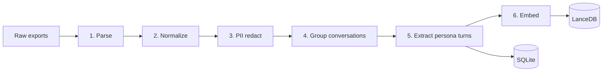

# Data Pipeline

End-to-end ingest: chat exports → parsed turns → PII-redacted → embedded → stored.

## Inputs

| Source | Path convention | Format |
|---|---|---|
| Telegram | `data/raw/telegram/result.json` | Telegram Desktop "machine-readable JSON" export |
| Instagram | `data/raw/instagram/your_instagram_activity/messages/inbox/` | Instagram data download "messages JSON" |

Drop anywhere under `data/raw/`. Parsers auto-discover.

## Output

```
data/
├── persona.db        # SQLite: conversations, turns, users, memory
└── vectors.lance/    # LanceDB: PersonaTurn embeddings
```

## Stages



### 1. Parse

Per-source parsers in `persona_rag/ingest/`:

- `telegram_parser.py` — reads `result.json`, iterates `chats[].messages[]`. Skips service messages, polls, media without text.
- `instagram_parser.py` — walks `messages/inbox/*/message_*.json`, handles split-files. Decodes Latin-1 → UTF-8 (Instagram's known mojibake).

Both emit `RawMessage` records:

```python
class RawMessage:
    channel: Literal["telegram", "instagram"]
    chat_id: str
    sender_id: str
    sender_name: str
    text: str
    timestamp: datetime
    is_group: bool
```

### 2. Normalize

- Hash `chat_id`, `sender_id` with `BLAKE2b(key=PERSONA_NAME)` so the SQLite DB doesn't store recipient identities in plaintext.
- Drop empty texts, edits, media-only messages.
- Detect language with `langdetect` per message; store as ISO 639-1.
- Drop group chats unless `INCLUDE_GROUP_CHATS=true`. Persona signal in group chats is much noisier — you reply less, with shorter messages, often to a moving target.

### 3. PII redact

Regex + word-list based. Configurable in `.env`:

```
PII_PATTERNS=phone,email,address,iban,credit_card
PII_NAMES=alice,bob,...           # comma-separated personal names to redact
PII_REPLACE_TOKEN=<REDACTED>
```

Rules applied in order:

1. Phone numbers (E.164 + common local formats)
2. Email addresses
3. URLs (kept by default — they're identity markers; toggle with `STRIP_URLS=true`)
4. IBAN / credit-card-shaped digits
5. Custom name list (case-insensitive whole-word)

**Not redacted:** emojis, capitalization, punctuation quirks, slang, code-switching. These are the persona signal.

Implementation: `persona_rag/ingest/pii.py`. Output stored both in SQLite (`conversations.text_redacted`) and the original kept locally only in `data/raw/`.

### 4. Group conversations

Within a single `chat_id`:

- Sort by `timestamp` ascending
- Collapse consecutive same-sender messages within `MESSAGE_BURST_SECONDS` (default 300) into one message, joined with `\n`
- Cut into "sessions" wherever the inter-message gap exceeds `SESSION_BREAK_HOURS` (default 6)
- Drop sessions shorter than `MIN_SESSION_TURNS` (default 4)

This avoids two failure modes from the predecessor:

- **No more forced alternation.** The old code treated every odd row as a question and every even row as an answer, dropping unmatched messages. Here we keep the natural turn structure.
- **No back-translation augmentation.** That destroyed exactly the style signal we want to preserve.

### 5. Extract persona turns

For each session, walk forward and emit one `PersonaTurn` per "your reply" event:

```python
class PersonaTurn:
    id: str                          # uuid4
    your_reply: str                  # raw, cased, emoji-preserved
    incoming_context: list[str]      # last CONTEXT_TURNS messages (default 10)
    channel: Literal["telegram", "instagram"]
    chat_id_hash: str
    recipient_id_hash: str
    timestamp: datetime
    language: str
    your_reply_len_chars: int
    your_reply_emoji_count: int      # cheap stylometric feature
```

A "your reply" event = a message where `sender_id == ADMIN_TELEGRAM_ID` (the persona owner is, by definition, the bot's admin).

`incoming_context` is the chronological window of the last `CONTEXT_TURNS` messages (mix of sender), terminated when crossing a session boundary.

### 6. Embed + store

- Batch-embed `your_reply` (not the context — we retrieve on what the persona said) with `text-embedding-3-small`.
- Batch size 128. Use OpenAI's batch API for cost if dataset > 100k turns.
- Write `(PersonaTurn, embedding)` rows into LanceDB.
- Write full `PersonaTurn` into SQLite as source of truth.

Why embed `your_reply` instead of `incoming_context`? Because at inference we want retrieval over "times I said something like this," not "times someone asked me something like this." The latter retrieves by topic; the former retrieves by *response register*, which is closer to what we want for style transfer. (Alternative: embed both and concatenate vectors — tunable in `index/embedder.py` if quality demands it.)

---

## Reproducibility

The pipeline is idempotent. Running `scripts/ingest.py` twice on the same input:

- Detects identical raw files by content hash and skips parse
- Re-runs PII redaction (cheap — schema may have evolved)
- Re-embeds only new turns (deduped by `PersonaTurn.id`)

To force a clean rebuild: `scripts/reindex.py --wipe`.

---

## Cost (OpenAI embeddings)

`text-embedding-3-small`: $0.02 per 1M tokens.

| Turns | Avg tokens/turn | Total tokens | Cost |
|---|---|---|---|
| 1,000 | 30 | 30k | $0.0006 |
| 10,000 | 30 | 300k | $0.006 |
| 100,000 | 30 | 3M | $0.06 |

Negligible. Inference token cost dominates the budget.

---

## Schema reference (SQLite, SQLModel)

```sql
CREATE TABLE conversations (
    id INTEGER PRIMARY KEY,
    chat_id_hash TEXT NOT NULL,
    channel TEXT NOT NULL,
    started_at DATETIME NOT NULL,
    ended_at DATETIME NOT NULL,
    message_count INTEGER NOT NULL
);

CREATE TABLE messages (
    id INTEGER PRIMARY KEY,
    conversation_id INTEGER REFERENCES conversations(id),
    sender_id_hash TEXT NOT NULL,
    is_persona BOOLEAN NOT NULL,
    text TEXT NOT NULL,            -- PII-redacted
    timestamp DATETIME NOT NULL,
    language TEXT
);

CREATE TABLE persona_turns (
    id TEXT PRIMARY KEY,           -- uuid
    your_reply TEXT NOT NULL,
    incoming_context_json TEXT NOT NULL,  -- JSON array
    channel TEXT NOT NULL,
    chat_id_hash TEXT NOT NULL,
    recipient_id_hash TEXT NOT NULL,
    timestamp DATETIME NOT NULL,
    language TEXT NOT NULL,
    your_reply_len_chars INTEGER,
    your_reply_emoji_count INTEGER
);
```

LanceDB columns mirror `persona_turns` plus a `vector` column (1536-d float32 for `text-embedding-3-small`).
