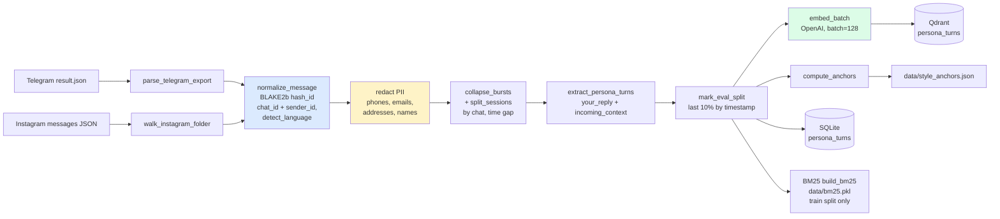

# Evaluation

How to measure whether the bot sounds like the persona. The runner replays held-out turns through the live graph and scores generated replies against the real ones by distribution.

## Why distributional stylometry beats BLEU/ROUGE

BLEU and ROUGE score n-gram overlap against a single reference reply. A persona is a distribution, not one string. Two replies with zero shared words can both be in voice, and a reply that copies the reference n-grams can still be out of voice if its shape is wrong. Overlap metrics reward surface copying and stay blind to shape failures.

The concrete failure they miss is shape uniformity. The legacy `persona_rag/eval/stylometry.py` reduces each side to a corpus mean, so a bot that always emits one 45-character bubble scores near zero against a real speaker who alternates between one-word bursts and four-message replies. The mean matches while the distribution is wrong. `persona_rag/eval/distribution.py` exists to make that gap visible by comparing full distributions of message shape, per-bubble length, punctuation, code-switch, and opener choice.

## The runner

`make eval` runs `scripts/eval_persona.py` (no arguments). The CLI accepts `--n` (held-out turns to sample, default 80), `--seed`, `--name`, `--model` (override the generation model for this run only), and `--register` (`on`/`off` to A/B the register-aware tone fix without touching `.env`).

```bash
make eval
uv run python scripts/eval_persona.py --n 80 --seed 0 --name baseline
uv run python scripts/eval_persona.py --n 80 --name reg-off --register off
```

Each run:

1. Samples held-out turns (`eval_split == True`) that have a real reply and a non-empty incoming context.
2. Sets `SHADOW_MODE=true` and `MEMORY_UPDATE_INTERVAL_TURNS=0` before importing settings, so the graph skips the Telegram send and the paid memory-update calls do not fire during replay.
3. Seeds each turn's prior context as session history, then invokes the full graph on the final incoming message and reads `state["reply"]`.
4. Scores all generated replies against all real replies with `persona_distance`, plus the optional authorship cosine.
5. Writes `data/eval/<name>/pairs.csv` and `data/eval/<name>/scorecard.json`, then prints a human scorecard to stdout.

## Held-out split

Two split mechanisms exist for two consumers.

**Retrieval / eval (temporal tail).** `mark_eval_split` in `persona_rag/ingest/turns.py` sorts turns by timestamp and tags the last 10% as `eval_split=True`. This is the `eval_split` column written to SQLite and indexed in Qdrant. Retrieval excludes it: `persona_rag/index/qdrant_store.py` adds `FieldCondition(key="eval_split", match=MatchValue(value=False))` by default, so held-out turns never appear in few-shot examples. `scripts/eval_persona.py` samples from this set as ground truth.

**Fine-tune export (recipient-stratified hash).** A temporal tail puts the English-heavy recent months entirely in eval, which made the `latin_script_rate` target unreachable for the fine-tune set. `eval_split_for` in `persona_rag/finetune/dataset.py` replaces it with a deterministic SHA-1 hash of the turn id (`int(h[:8], 16) % 1000 < frac * 1000`). Each recipient is split independently at the same fraction, so train and eval share the same recipient mix and therefore the same code-switch register. The fine-tune dataset uses this hash, not the DB column.

Both are deterministic and reproducible. Neither is random across the whole corpus, because a random split leaks today's style into the past.

The ingest pipeline produces this split and the train/eval boundary that feeds the indices:



## The metrics

All metrics are pure functions in `persona_rag/eval/distribution.py`. The code is the source of truth for every formula. Bubbles are Telegram messages split by `split_bubbles` in `persona_rag/generate/bubbles.py` (newline split, blanks dropped).

### Headline distances (lower is closer to the real speaker)

| Key | Function | What it measures |
|---|---|---|
| `shape_js` | `js_divergence(shape_histogram(real), shape_histogram(gen))` | Jensen-Shannon divergence between the bubble-count-per-reply histograms (bucketed 1..6). Log base 2, so bounded [0, 1]. 0 = identical shape, 1 = disjoint. This is the primary number; it catches shape uniformity. |
| `len_wasserstein` | `wasserstein_1d` | 1-D Wasserstein (earth-mover) distance between the per-bubble character-length samples. |
| `len_ks` | `ks_statistic` | Kolmogorov-Smirnov statistic: max gap between the two empirical length CDFs. |

### Voice-fingerprint rates (compared real vs gen, not reduced to one distance)

| Key | Function | Signal |
|---|---|---|
| `latin_script_rate` | `latin_script_rate` | Share of alphabetic tokens in Latin vs Cyrillic script. The code-switch signal. A bot pinned to one language drops near zero. |
| `paren_smiley_rate` | `paren_smiley_rate` | Fraction of bubbles containing a paren-smiley, detected as an unbalanced close paren (`)` count > `(` count) so ordinary parentheticals do not count. The signature tic the emoji-codepoint metric is blind to. |
| `opener_top_share` | `opener_top_share` | Share of replies that open with the single most common first word. The opener-monotony signal: a bot that opens every reply the same way scores high. |

`persona_distance` returns `shape_js`, `len_wasserstein`, `len_ks`, `pct_single_real`, `pct_single_gen`, and the full `summarize` dict for each side (`real`, `gen`). The summary carries `shape_hist`, `bubble_len_median`, `bubble_len_mean`, `caps_ratio_mean`, `punct_density_mean`, `emoji_rate_mean`, and the three rates above. The printed scorecard renders the shape histogram side by side, the percentage of single-message replies, and real-vs-gen lines for each rate.

### Optional authorship cosine

`style_self_sim` is a content-independent voice-fidelity signal from `persona_rag/eval/authorship.py`. It embeds replies with a style encoder (`StyleDistance/styledistance` by default, overridable via `STYLE_EMBED_MODEL`), builds a reference centroid from the real replies (`reference_vector`), and scores the generated replies by mean cosine to it (`self_similarity`). Higher is more like the persona's surface voice, and it survives code-switch and topic drift in a way the deterministic distances cannot.

The encoder needs `torch` and a model download, so it is lazy and guarded by try/except at the call site in `scripts/eval_persona.py`. When the model is not installed, `style_self_sim` is `None` and the rest of the scorecard is unaffected. The same centroid (`cached_reference_vector`, train-split only) doubles as the best-of-N selector in the live generate path when `BEST_OF_N > 1`.

## Reading the scorecard

`data/eval/<name>/scorecard.json` holds the distances, the optional `style_self_sim`, `n_generated`, `seed`, a timestamp, and the run params: `top_k`, `alpha` (`HYBRID_DENSE_ALPHA`), `mmr_enabled`, `register_aware`, `shape_hint`, `best_of_n`, `paren_logit_bias`, `backend` (`GENERATION_BACKEND`), `model`, `temperature`, and `score_floor` (`HYBRID_SCORE_FLOOR`). Those params are what you change between runs to find what moves the distances.

Run two configs (for example `--register on` and `--register off`, or two `--model` values) with the same `--seed`, then compare their scorecards. `shape_js` and `len_wasserstein` are the numbers to watch first. If they are flat and the rates are off, look at `latin_script_rate`, `paren_smiley_rate`, and `opener_top_share` for the specific tic that is wrong.

## Shadow mode and the (incoming, real, generated) triple

`pairs.csv` is the blind A/B substrate. Each row is `(incoming, real, generated)`, written through the `csv` module so embedded quotes, commas, and newlines round-trip. A rater can read `real` against `generated` in random order and pick "more like me" without knowing which is which. The same triple is the future DPO training pair: `chosen = real`, `rejected = generated`.

Shadow mode also runs against live traffic, not just held-out replay. `SHADOW_MODE=true` routes the graph through the `shadow_log` node (`persona_rag/graph/compile.py`) instead of sending the reply. `write_shadow_entry` in `persona_rag/shadow/logger.py` appends a JSONL row to `data/shadow_log.jsonl` (`SHADOW_LOG_PATH`):

```json
{
  "ts": "...",
  "session_id": "uuid",
  "user_id_hash": "...",
  "incoming": "actual incoming message",
  "context": ["..."],
  "retrieved_ids": ["..."],
  "memory_summary": "...",
  "generated_reply": "what the bot would have said",
  "your_actual_reply": null,
  "model": "gpt-4o-mini",
  "params": {"...": "..."}
}
```

`your_actual_reply` is null at write time and backfilled later from the real Telegram export on re-ingest. Once enough triples accumulate, the (incoming, generated, your_actual_reply) set becomes the blind A/B corpus against true ground truth and the DPO dataset for the fine-tune phase.

## MLflow

MLflow runs as a compose service (`docker-compose.yml`), image `ghcr.io/mlflow/mlflow:v2.16.0`, published on host port 5001 mapped to container port 5000 (macOS AirPlay holds 5000). `make up` starts it alongside Qdrant; `make mlflow-ui` opens `http://localhost:5001`. Config defaults are `MLFLOW_TRACKING_URI=file:./mlruns` and `MLFLOW_EXPERIMENT=persona-rag-eval`.

`persona_rag/eval/mlflow_wrap.py` provides `log_eval_run`, a wrapper that ensures the experiment exists, opens a run, and logs params, metrics, tags, and artifacts. The current `scripts/eval_persona.py` writes `scorecard.json` and `pairs.csv` to `data/eval/<name>/` and does not call `log_eval_run` itself, so MLflow logging is wiring that is available but not yet invoked by the runner.

## CI

CI does not run eval. It generates replies through OpenAI, which costs money and is slow. Run it manually after a prompt, retrieval, or schema change. The repo has 72 Python test files for the deterministic units (split logic, the pure distribution functions, the centroid and cosine math); those run in CI and cover everything in `distribution.py` and `authorship.py` that does not need a model or the live graph.
