# Self-insights pipeline

The self-insights pipeline distills durable, first-person facts about the persona out of the raw chat corpus, then serves a small slice of them into the live bot prompt. It is a batch job (`scripts/distill_insights.py`), separate from the chat path. Output lands in two places: a SQLite `insight_row` table (the full record, including human-reviewable `pending` rows) and a Qdrant `self_insights` collection (the embedded subset the bot retrieves at chat time).

The pipeline runs Stages A through F. Stage A is algorithmic. Stages C, D, and the C-to-D verification gate make LLM calls. The design that hardened extraction accuracy lives in `docs/superpowers/specs/2026-05-31-insights-extraction-accuracy-design.md`; this document consolidates the shipped behavior.

## Pipeline diagram

```mermaid
%% Self-insights batch pipeline (scripts/distill_insights.py)
%% Stages A-F. Verify gate (C->D) is optional, off by default.
flowchart LR
    corpus["PersonaTurnRow corpus<br/>(eval_split = false)"]

    subgraph A["Stage A - algo signals"]
        a1["run_stage_a()<br/>entity / freq signals"]
    end

    subgraph B["Stage B - sessionize"]
        b1["build_sessions(gap_hours=6)"]
        b2["filter_high_signal()<br/>min turns / chars / max"]
    end

    subgraph C["Stage C - gpt-4o extraction"]
        c1["extract_from_session()<br/>INSIGHTS_EXTRACT_MODEL"]
        c2["RawInsight + Me: quote check"]
        c3[("raw_insight + run_state<br/>resumable checkpoint")]
    end

    V{"Verify gate (optional)<br/>_apply_verification()<br/>INSIGHTS_VERIFY_ENABLED"}
    Vmodel["verify_raw()<br/>gpt-4o-mini<br/>drop NO, keep YES/AMBIGUOUS"]

    subgraph D["Stage D - consolidate"]
        d1["consolidate()<br/>load_synonyms()"]
        d2["ConsolidatedInsight<br/>evidence / distinct_partners"]
    end

    subgraph E["Stage E - route gates"]
        e1["route_insight()<br/>confidence / evidence<br/>distinct-partner / staleness"]
        e2["review_status:<br/>auto | pending"]
    end

    subgraph F["Stage F - persist"]
        f1["persist_insights()"]
        f2[("SQLite InsightRow")]
        f3[("Qdrant self_insights<br/>embed + upsert auto/approved")]
    end

    corpus --> a1
    a1 -->|"persist_algo_signals()"| b1
    b1 --> b2
    b2 --> c1
    c1 --> c2 --> c3
    c3 --> V
    V -->|"enabled"| Vmodel --> d1
    V -. "disabled (default)" .-> d1
    d1 --> d2 --> e1
    e1 --> e2 --> f1
    f1 --> f2
    f1 --> f3
```

Note: the diagram comment labels the verify gate "off by default." The shipped config default is `INSIGHTS_VERIFY_ENABLED = True` (`persona_rag/config.py`), so the gate runs unless the operator turns it off.

## Stage A: algorithmic signals

`persona_rag/insights/algo.py:run_stage_a` runs five cheap, deterministic extractors over the persona's own replies (no LLM). It always re-runs, even on incremental runs, because it is cheap.

| Signal kind | Extractor | What it produces |
|-------------|-----------|------------------|
| `entity` | `extract_entities` | Candidate topical tokens from persona replies, ranked by `count × distinct_session_count`, capped at 50 |
| `rhythm` | `extract_counterparty_rhythms` | Per-recipient stats (message count, avg chars, emoji rate), top 20 |
| `language` | `extract_languages` | Language distribution with per-language percentages |
| `phase` | `extract_phases` | Per-quarter buckets with top entities and primary language |
| `style` | `extract_style` | All-caps frequency, multi-line burst count, code-switch count |

Entity mining passes each candidate through `passes_entity_filter` (`persona_rag/insights/blocklists.py`). A whitelist built from `synonyms.yaml` (canonical subjects plus variants, lowercased) bypasses the blocklist, so user-blessed tokens are never filtered. The top entities feed two consumers: `entity_hints` (the first 10 subjects, passed into the Stage C extractor prompt) and the `algo_signal` table (read at chat time by `retrieve_insights`).

Results persist via `persist_algo_signals`, which truncates and rewrites the `algo_signal` table each run.

## Stage B: sessionize

`persona_rag/insights/sessions.py` groups the corpus into sessions, then filters for signal.

- `build_sessions(rows, gap_hours=6)` groups turns by `chat_id_hash`, splitting whenever the gap between consecutive turns exceeds 6 hours. Each `SessionDoc` gets a deterministic 16-char `session_id` (sha1 of `chat_id:start_iso`).
- `filter_high_signal` drops sessions that fall outside the history window (`INSIGHTS_HISTORY_YEARS`, default 2.5 years), have fewer than `INSIGHTS_MIN_SESSION_TURNS` persona turns (default 10), have fewer than `INSIGHTS_MIN_SESSION_CHARS` persona characters (default 300), or whose non-reaction ratio is below 0.20. Survivors sort by persona character count descending and cap at `max_sessions` (default `INSIGHTS_MAX_SESSIONS = 600`, overridable with `--max-sessions`).

The corpus is loaded with `eval_split == False`, so held-out evaluation turns never enter extraction.

## Stage C: gpt-4o extraction with resumable checkpoints

`persona_rag/insights/extractor.py:extract_from_session` makes one LLM call per surviving session using `INSIGHTS_EXTRACT_MODEL` (default `gpt-4o`), temperature 0.2, JSON-object response format.

The session is rendered with explicit speaker labels: `Me:` for persona turns, `Contact-XXXXXXXX:` (the first 8 hex of `recipient_id_hash`) for the other party. The system prompt extracts into four categories (`bio`, `opinion`, `interest`, `behavior`) and enforces three attribution rules: every insight needs a `source_quote` from a `Me:` turn, topics raised only by a `Contact:` are skipped, and third-party activity is not attributed to the persona.

`parse_extractor_response` validates each candidate. The `source_quote` must appear (case-insensitive substring, at least 10 chars) in some `Me:` turn of the session, or the candidate is dropped silently. Surviving rows are tagged `source_quote_validated = True`.

### Resumable checkpoint

Stage C writes a per-session checkpoint so a mid-run crash never costs re-extraction of completed sessions.

- `_persist_raws_and_mark` writes the extracted raws to `raw_insight` and marks the session done in `insight_run_state`, both in one transaction. If the process dies between the LLM call and the commit, nothing lands and the session is re-extracted next run.
- On an `incremental` run, `_load_resume_state` reads `insight_run_state` rows where `failed == False`, adds those session IDs to a skip set, and hydrates their raws from `raw_insight` back into memory. Stage D then sees the union of resumed plus newly-extracted raws, identical to a no-crash baseline.
- A session that raises is recorded by `_mark_session_failed` (sets `failed = True`, stores a truncated error). Failed sessions are retried on the next incremental run.
- `--force-session <id>` re-extracts one specific session even if it is checkpointed as done.

## Stage C to D: verification gate

`persona_rag/insights/verifier.py:verify_raw` is a second-opinion LLM gate between extraction and consolidation, controlled by `INSIGHTS_VERIFY_ENABLED` (default `True`). When disabled, all raws pass through untouched.

Each raw goes to `INSIGHTS_VERIFY_MODEL` (default `gpt-4o-mini`), temperature 0.0, JSON mode, asking whether the `source_quote` actually supports the claim with the persona as subject. The verdict is `YES`, `NO`, or `AMBIGUOUS`:

- `NO` drops the raw.
- `YES` and `AMBIGUOUS` are kept, with `verification_verdict` and `verification_reason` recorded on the raw for the audit trail.
- API or JSON errors fail open: the verdict is `None` and the raw is kept, so a verifier blip never silently discards legitimate insights.

`_apply_verification` runs these calls concurrently under an `asyncio.Semaphore` sized by `INSIGHTS_VERIFY_CONCURRENCY` (default 10).

## Stage D: consolidation and synonyms

`persona_rag/insights/consolidator.py:consolidate` groups raws by `(category, normalized_subject)` and produces one `ConsolidatedInsight` per group.

- `normalize_subject` lowercases, strips punctuation (preserving `+` for tokens like `c++`), collapses whitespace, then maps the subject onto its canonical form via `synonyms.yaml` (loaded by `load_synonyms`). Synonyms are what merge `мама` / `mom` style variants into one subject.
- Groups of 3 or more members are merged by an LLM call (`INSIGHTS_CONSOLIDATE_MODEL`, default `gpt-4o-mini`) whose prompt preserves concrete particulars (genres, places, names, numbers) verbatim and emits a one-line trajectory note. Smaller groups keep the highest-confidence member's text with no LLM call.
- `distinct_partners` is the count of unique `recipient_id_hash` values across the group's source sessions, computed from a `session_to_partners` map passed in from the driver. Stage E uses it to require evidence breadth.

### Deterministic insight IDs

Each `ConsolidatedInsight.id` comes from `_stable_insight_id(category, canonical_subject)`: a 16-char sha1 of `category:canonical_subject`. The same `(category, subject)` always maps to the same ID across runs. This is what lets Stage F upsert rather than duplicate, and it preserves any user edits or review decisions attached to that ID (see Stage F).

## Stage E: routing gates

`persona_rag/insights/router.py:route_insight` assigns a `review_status` of `auto` or `pending` to each consolidated insight. An insight is demoted to `pending` if any gate fails:

| Gate | Config key | Default | Rule |
|------|------------|---------|------|
| Staleness | `INSIGHTS_STALE_DEMOTE_YEARS` / `INSIGHTS_STALE_DEMOTE_MIN_EVIDENCE` | 2.0 yrs / 5 | Older than the cutoff AND weakly evidenced → `pending` |
| Distinct partners | `INSIGHTS_MIN_DISTINCT_PARTNERS` | 2 | Fewer than N distinct chat partners → `pending` |
| Confidence + evidence | `INSIGHTS_CONFIDENCE_THRESHOLD` / `INSIGHTS_MIN_EVIDENCE` | 0.7 / 3 | Needs both at or above threshold for `auto` |

The distinct-partner gate stops three misattributions from one chat thread from looking like three independent confirmations. Anything that clears all gates is routed `auto`; everything else is `pending`, where a human reviews it.

## Stage F: persistence

`persona_rag/insights/persistence.py:persist_insights` writes every insight to SQLite and embeds the eligible subset into Qdrant.

- **SQLite (`insight_row`):** keyed by the deterministic insight ID. New IDs insert with the routed status. Existing IDs are upserted, with user-touch protection: if a row is `source` in (`user_verified`, `onboarding`) or its `review_status` is `rejected`, only freshness fields (evidence count, earliest/latest date) are bumped; the text, status, source, and confidence the user set are left intact. A plain `source = chat` row in `auto`/`pending` gets a full refresh.
- **Qdrant (`self_insights`, `QDRANT_INSIGHTS_COLLECTION`):** only insights routed `auto` or `approved` are embedded (`embed_batch`, 1536-dim `text-embedding-3-small`, cosine) and upserted. The Qdrant point ID derives from the SQLite ID via `to_qdrant_point_id`. `pending` and `rejected` insights stay out of the retrievable collection.

`ensure_insights_collection` creates the Qdrant collection if it is missing before the upsert.

## Budget

`INSIGHTS_BUDGET_HARD_CAP_USD` (default 5.0) is defined in config but is not enforced as a hard stop in the pipeline code. The cost gate is the dry-run: `--dry-run` (or `make insights-dry`) estimates spend from the session count (one extraction call per session, priced at gpt-4o rates) and exits without any LLM call. The spec's per-full-run cost estimate sits well under the cap, but the operator is expected to run the dry-run as the check, not rely on an in-loop abort.

## How insights reach the live prompt

At chat time, `persona_rag/graph/nodes/retrieve_insights.py:retrieve_insights` runs as a graph node between `load_memory` and `load_session` (wired in `persona_rag/graph/compile.py`). When `INSIGHTS_ENABLED` is true it:

1. Embeds the incoming message and queries `self_insights` for a candidate pool (`INSIGHTS_TOP_K_SEMANTIC * 3`), filtered to `review_status` in (`auto`, `approved`).
2. Reranks the pool with recency (`rerank_with_recency`, half-life `INSIGHTS_RECENCY_HALF_LIFE_DAYS`), drops anything below `INSIGHTS_MIN_SCORE_FLOOR`, and keeps the top `INSIGHTS_TOP_K_SEMANTIC`.
3. Loads top static algo signals (languages, entities) when `INSIGHTS_STATIC_PATTERNS_ENABLED` is set.

The retrieved insights land in `state["insights"]`. On the OpenAI generation path, `persona_rag/generate/prompt.py:build_messages` calls `_render_insights_block`, which separates `bio` insights into a "What's true about you (bio facts):" section from the "Things you talk about / are into:" section, giving the bio-anchor priority rule a visible target. `generate_persona_description` (`persona_rag/insights/persona_description.py`) renders the persona description from up to 5 highest-confidence `user_verified` / `onboarding` bio insights.

### LoRA thin path

When `GENERATION_BACKEND == "ollama"`, `build_messages` serves the thin shape the fine-tuned adapter trained on (`build_thin_messages`), not the heavy template. The full insights block is deliberately omitted. If `OLLAMA_FACTS_IN_SYSTEM` is set, `_compact_facts` folds a short, capped (400 char) facts addendum into the system turn: contact memory plus `bio`-category insights only. The system turn is outside the training loss, so a brief addendum is a mild conditioning shift; the full insights block would re-introduce the register skew the thin serving prompt exists to avoid.

## Run modes

`scripts/distill_insights.py` takes `--mode`:

| Mode | Behavior |
|------|----------|
| `incremental` (default) | Runs Stage A through F, skipping sessions already checkpointed as done and hydrating their raws from `raw_insight`. Retries previously-failed sessions. |
| `full` | `_full_truncate` wipes `insight_row`, `insight_run_state`, `algo_signal`, and `raw_insight`, then runs the whole pipeline from scratch. |
| `reembed` | `_reembed_only` re-embeds and upserts every `auto`/`approved` SQLite insight to Qdrant. No LLM calls. |
| `reconsolidate` | Currently a stub (`_reconsolidate_only` logs and returns without re-running Stage D). |

Make targets: `make insights` (incremental), `make insights-full` (full), `make insights-dry` (dry-run cost estimate).

## Source map

| Concern | File |
|---------|------|
| Driver / stage orchestration | `scripts/distill_insights.py` |
| Stage A signals | `persona_rag/insights/algo.py` |
| Stage B sessionize | `persona_rag/insights/sessions.py` |
| Stage C extract + parse | `persona_rag/insights/extractor.py` |
| Verification gate | `persona_rag/insights/verifier.py` |
| Stage D consolidate + synonyms | `persona_rag/insights/consolidator.py` |
| Stage E routing | `persona_rag/insights/router.py` |
| Stage F persist | `persona_rag/insights/persistence.py` |
| Persona description render | `persona_rag/insights/persona_description.py` |
| Chat-time retrieval | `persona_rag/graph/nodes/retrieve_insights.py` |
| Prompt assembly | `persona_rag/generate/prompt.py` |
| Config knobs | `persona_rag/config.py` |
| Design spec | `docs/superpowers/specs/2026-05-31-insights-extraction-accuracy-design.md` |

The repository carries 72 Python test files under `tests/` covering these modules.
