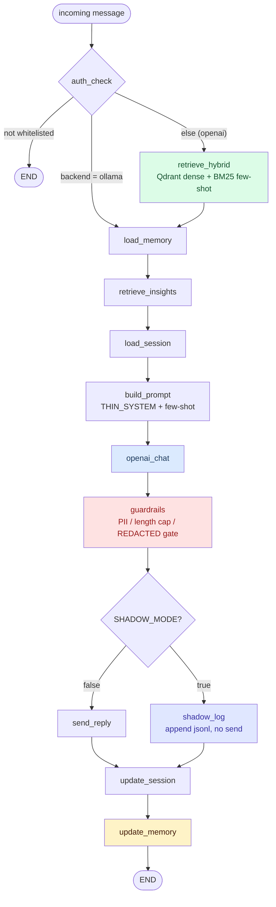

# Request Pipeline (per-message path)

This document walks the full path a single inbound message takes through the
LangGraph state machine, from the moment it arrives to the moment a reply is
sent (or logged in shadow mode). Read it before touching anything under
`persona_rag/graph/`.

The graph is defined and compiled in `persona_rag/graph/compile.py`. It is a
`StateGraph` over the `GraphState` TypedDict (`persona_rag/graph/state.py`).
There are 12 nodes and 2 conditional branch points. Every node is a function
that takes the `GraphState` dict, mutates a few keys, and returns it.

## The graph (L3 component diagram)



## GraphState keys

The shared state is a `TypedDict(total=False)`, so any key may be absent until a
node writes it. Nodes read with `state.get(...)` for keys that earlier nodes may
have skipped. Defined in `persona_rag/graph/state.py`:

| Key | Type | Written by | Read by |
|-----|------|-----------|---------|
| `incoming` | `str` | entry (caller) | `retrieve_hybrid`, `retrieve_insights`, `build_prompt`, `shadow_log`, `update_session` |
| `user_id` | `int` | entry (caller) | `auth_check`, `load_memory`, `load_session`, `shadow_log`, `update_session`, `update_memory` |
| `chat_id` | `int` | entry (caller) | `send_reply` |
| `session_id` | `str` | entry (caller) | `shadow_log` |
| `auth_state` | `str` | `auth_check` | `_route_after_auth` |
| `retrieved` | `list[RetrievedTurn]` | `retrieve_hybrid` | `build_prompt`, `shadow_log` |
| `memory` | `str` | `load_memory` | `build_prompt`, `shadow_log` |
| `insights` | `dict[str, Any]` | `retrieve_insights` | `build_prompt` |
| `session` | `list[ChatMessage]` | `load_session`, `update_session` | `build_prompt`, `shadow_log`, `update_memory` |
| `style_anchors_json` | `str` | (declared; not populated on the runtime path) | none on this path |
| `prompt` | `list[dict[str, str]]` | `build_prompt` | `openai_chat` |
| `reply` | `str` | `openai_chat`, `guardrails` | `send_reply`, `shadow_log`, `update_session` |
| `shadow` | `bool` | (declared) | none on this path |

`insights` carries the shape `{"semantic": list[RankedInsight], "static": dict}`.
`style_anchors_json` and `shadow` are declared on the TypedDict but are not set
by any node in `compile.py`; the prompt builder loads style anchors from disk
itself (see `build_prompt` below).

## The two branch points

Both branches live in `compile.py` as plain functions wired with
`add_conditional_edges`.

### `_route_after_auth` (after `auth_check`)

```python
def _route_after_auth(state: GraphState) -> str:
    if state.get("auth_state") != UserState.WHITELISTED.value:
        return END
    if get_settings().GENERATION_BACKEND == "ollama":
        return "load_memory"
    return "retrieve_hybrid"
```

Three outcomes:

1. Sender is not whitelisted: route straight to `END`. No retrieval, no
   generation, no reply.
2. `GENERATION_BACKEND == "ollama"`: route to `load_memory`, skipping
   `retrieve_hybrid`. The LoRA backend serves a thin prompt and never injects
   retrieved few-shot turns, so few-shot retrieval is dead weight on that path.
   It also skips the only per-message OpenAI embedding call: `retrieve_hybrid`
   embeds the incoming message for dense search, and that is the single runtime
   phone-home to OpenAI on the retrieval side. The facts layer
   (`load_memory` then `retrieve_insights`) still runs and feeds
   `OLLAMA_FACTS_IN_SYSTEM`.
3. Otherwise (the OpenAI backend): route to `retrieve_hybrid` and run the full
   few-shot pipeline.

### `_route_after_guardrails` (after `guardrails`)

```python
def _route_after_guardrails(state: GraphState) -> str:
    if get_settings().SHADOW_MODE:
        return "shadow_log"
    return "send_reply"
```

When `SHADOW_MODE` is on, route to `shadow_log` (append a JSONL record, send
nothing). When it is off, route to `send_reply` (deliver to Telegram). Both
paths reconverge at `update_session`.

## The 12 nodes

Nodes are listed in execution order along the OpenAI (full) path. Files are
under `persona_rag/graph/nodes/`.

### 1. `auth_check`

- File: `auth_check.py`
- Purpose: resolve whether the sender is allowed to be answered.
- Reads: `user_id`. Writes: `auth_state`.
- Calls `get_user_state(user_id)` from `persona_rag/bot/auth.py` and stores its
  `.value` (a `UserState`). The next branch compares it against
  `UserState.WHITELISTED.value`.

### 2. `retrieve_hybrid`

- File: `retrieve_hybrid.py`
- Purpose: pull the most relevant few-shot example turns for the prompt. Runs
  only on the OpenAI path.
- Reads: `incoming`. Writes: `retrieved`.
- Builds a Qdrant client (`make_client`) and calls `retrieve(...)` from the
  `persona_rag.retrieval` package (`persona_rag/retrieval/__init__.py`) with
  `top_k=get_settings().TOP_K`. This is an `async` node and is where the
  per-message OpenAI embedding for dense search happens.
- MMR-reversal gotcha: when MMR is enabled, `retrieved` is returned in reversed
  order so the most-relevant example lands last. The model weights the final
  in-context example hardest, so putting the strongest pick at the end is
  deliberate. The node's own log line takes `retrieved[-3:]` to surface the
  highest-impact picks in the trace, which is consistent with that reversal.
  Anything downstream that reasons about ordering (the prompt builder, the
  trace) must respect "best last," not "best first."

### 3. `load_memory`

- File: `load_memory.py`
- Purpose: load the long-form contact-memory summary for this sender.
- Reads: `user_id`. Writes: `memory`.
- Thin wrapper over `load_contact_memory(user_id)` from
  `persona_rag/memory/store.py`. On the ollama path this is the graph entry
  point after `auth_check`.

### 4. `retrieve_insights`

- File: `retrieve_insights.py`
- Purpose: retrieve self-insights (semantic and static) about how the persona
  behaves, for injection into the prompt.
- Reads: `incoming`. Writes: `insights`.
- Returns early and writes nothing when `INSIGHTS_ENABLED` is false. Otherwise:
  embeds the incoming message (`embed_batch`), queries the
  `QDRANT_INSIGHTS_COLLECTION` for a candidate pool of
  `INSIGHTS_TOP_K_SEMANTIC * 3` points filtered to `review_status` in
  `{"auto", "approved"}`, reranks with recency
  (`rerank_with_recency`, half-life `INSIGHTS_RECENCY_HALF_LIFE_DAYS`), applies
  the `INSIGHTS_MIN_SCORE_FLOOR` floor, then keeps the top
  `INSIGHTS_TOP_K_SEMANTIC`. Static signals (languages, entities) come from the
  `AlgoSignal` table via `_load_static_signals` when
  `INSIGHTS_STATIC_PATTERNS_ENABLED` is on. Any exception is caught and the node
  writes empty insights so the pipeline does not break.

### 5. `load_session`

- File: `load_session.py`
- Purpose: load recent conversational turns for this sender from the in-process
  session store.
- Reads: `user_id`. Writes: `session`.
- Reads from the module-level `_SESSIONS` dict (keyed by `user_id`). Writes an
  empty list when there is no entry or the entry has expired past
  `SESSION_TIMEOUT_MINUTES` (expired entries are evicted). The store is
  in-memory, with a comment noting Redis as a later option.

### 6. `build_prompt`

- File: `build_prompt.py`
- Purpose: assemble the final chat-message list (the cacheable prefix plus the
  live turn) that goes to the model.
- Reads: `memory`, `retrieved`, `session`, `incoming`, `insights`. Writes:
  `prompt`.
- Loads style anchors from `data/style_anchors.json` (falling back to a
  zero-valued `StyleAnchors` with `primary_language=PERSONA_LANGUAGE` when the
  file is absent), then calls `build_messages(...)` from
  `persona_rag/generate/prompt.py` with `PERSONA_NAME`, `PERSONA_DESCRIPTION`,
  the anchors, and the four retrieved/contextual inputs. Each retrieval-related
  key is read with `.get(...)` and a default, so the node is correct on the
  ollama path where `retrieved` was never written.

### 7. `openai_chat`

- File: `openai_chat.py`
- Purpose: call the generation backend and produce the candidate reply.
- Reads: `prompt`. Writes: `reply`.
- An `async` node. Computes a `voice_logit_bias()` and reads `BEST_OF_N`. When
  `n == 1`, calls `chat_complete(prompt, logit_bias=bias)`. When `n > 1`,
  samples `n` candidates at `BEST_OF_N_TEMPERATURE` via `chat_complete_n` and
  picks the most on-voice one with `select_best_style(candidates)`. All three
  helpers come from `persona_rag/generate/`.

### 8. `guardrails`

- File: `guardrails.py`
- Purpose: clean or suppress the model output before it can be sent.
- Reads: `reply`. Writes: `reply`.
- Calls `apply_guardrails(reply)` (`persona_rag/generate/guardrails.py`), which
  returns `(cleaned, ok)`. The node writes `cleaned` when `ok` is true and an
  empty string otherwise. An empty `reply` after this node means nothing gets
  sent and the session is not updated downstream.

### 9. `send_reply`

- File: `send_reply.py`
- Purpose: deliver the reply to Telegram as one or more bubbles. Runs only when
  `SHADOW_MODE` is off.
- Reads: `reply`, `chat_id`. Writes: nothing (delivery side effect).
- Returns early when the bot is not attached or `reply` is empty. Splits the
  reply into bubbles via `split_bubbles` (honouring `REPLY_SPLIT_NEWLINES`),
  then sends each chunk. Between chunks it shows a typing action and sleeps a
  jittered, length-scaled delay computed from the `REPLY_CHUNK_DELAY_*`
  settings, so consecutive messages do not fire at machine-precise intervals.
  The `_BOT` instance is injected at compile time via `attach_bot(...)`.

### 10. `shadow_log`

- File: `shadow_log.py`
- Purpose: record the would-be reply to a JSONL log without sending it. Runs
  only when `SHADOW_MODE` is on.
- Reads: `user_id`, `incoming`, `session`, `retrieved`, `memory`, `reply`,
  `session_id`. Writes: nothing on state (file side effect).
- Calls `write_shadow_entry(...)` (`persona_rag/shadow/logger.py`) with a hashed
  user id (`hash_id`), the session context, retrieved turn ids, the memory, the
  generated reply, and a params block (`TOP_K`, `HYBRID_DENSE_ALPHA`,
  `OPENAI_CHAT_MODEL`, `TEMPERATURE`).

### 11. `update_session`

- File: `update_session.py`
- Purpose: append the completed turn to the sender's session ring buffer.
- Reads: `reply`, `user_id`, `incoming`. Writes: `session`.
- No-op when `reply` is empty (auth-blocked, shadow with nothing recorded, or
  guardrail-stripped). Otherwise appends a user message and an assistant message
  to the `_SESSIONS` entry, caps the buffer to `CURRENT_SESSION_WINDOW`, updates
  `last_seen`, and mirrors the new message list back into `state["session"]` so
  `update_memory` sees the latest turn.

### 12. `update_memory`

- File: `update_memory.py`
- Purpose: distill the running session into the long-form contact-memory
  summary, on a throttle.
- Reads: `session`, `user_id`. Writes: nothing on state (memory store side
  effect).
- An `async` node. Returns early when the session is empty or
  `MEMORY_UPDATE_INTERVAL_TURNS <= 0`. Computes `completed_turns = len(session)
  // 2` and only calls `update_contact_memory(...)` when that count is a nonzero
  multiple of the interval, which keeps the extra OpenAI cost and latency off
  every single message. This is the last node before `END`.

## Notes for contributors

- Five nodes are `async def` (`retrieve_hybrid`, `retrieve_insights`,
  `openai_chat`, `send_reply`, `update_memory`); the other seven are plain
  functions. LangGraph awaits them transparently.
- The ollama path and the OpenAI path reconverge at `load_memory` and run the
  identical facts, session, prompt, generation, guardrail, and persistence
  stages from there.
- Tests covering the graph and its nodes live under `tests/` (the suite is 72
  Python files). When you change a node's read/write contract, update the state
  table above and the affected test.
