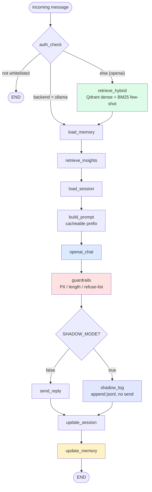

# Retrieval and Generation

How a single incoming message turns into a persona reply: hybrid few-shot retrieval, the two prompt shapes (OpenAI template vs LoRA thin serving), register and shape conditioning, the decoding voice levers, best-of-N style selection, and the bubble splitter.

This supersedes the still-true parts of the older `docs/archive/PROMPT-DESIGN.md`. Code references below were read from the repo; config defaults come from `persona_rag/config.py`.

## Pipeline at a glance

The per-message request runs as a LangGraph node pipeline. Retrieval and generation are two stages inside it.



Note the auth branch: when `GENERATION_BACKEND == "ollama"` the graph skips `retrieve_hybrid` entirely and routes straight to `load_memory`. The LoRA path does not consume few-shot retrieval (see Two prompt shapes below).

## Hybrid retrieval

Orchestrated by `retrieve()` in `persona_rag/retrieval/__init__.py`, called by the `retrieve_hybrid` graph node (`persona_rag/graph/nodes/retrieve_hybrid.py`). The flow:

1. **Candidate pool.** `retrieve()` asks both retrievers for a wide pool, not just `top_k`. When `MMR_ENABLED` the pool size is `MMR_POOL_SIZE`; when MMR is off it falls back to `k * 4`.
2. **Dense.** `retrieve_dense()` in `persona_rag/retrieval/dense.py` embeds the query with `OPENAI_EMBEDDING_MODEL` (`text-embedding-3-small`) and runs `search_dense` against the Qdrant collection `QDRANT_COLLECTION` (`persona_turns`). Dense scores land on `RetrievedTurn.score_dense`, and the dense hit carries its `embedding` vector.
3. **BM25.** `retrieve_bm25()` in `persona_rag/retrieval/bm25.py` loads the pickled index at `data/bm25.pkl`, scores the query, takes the top pool, then hydrates full `PersonaTurn` rows from SQLite. If the pickle is missing it returns an empty list, so the system degrades to dense-only. BM25 scores land on `score_bm25`. BM25-only hits have no `embedding`.
4. **Alpha fusion.** `fuse_scores()` in `persona_rag/retrieval/hybrid.py` min-max-normalizes each score set independently to `[0, 1]`, then fuses per id: `score = alpha * dense_norm + (1 - alpha) * bm25_norm`. `alpha` defaults to `HYBRID_DENSE_ALPHA` (0.7), so dense dominates. The fused entry keeps the dense embedding when both retrievers hit the same id (BM25-only ids keep `None`).
5. **Recency decay.** `recency_decay()` in `persona_rag/retrieval/rerank.py` multiplies each fused score by `exp(-ln(2) * age_days / half_life)` with `half_life = RECENCY_HALF_LIFE_DAYS` (180). At one half-life the score is halved. Timestamps without tzinfo are treated as UTC.
6. **Score floor.** Turns whose post-decay `score` is below `HYBRID_SCORE_FLOOR` (0.15) are dropped. This stops weak past-turn matches from feeding stray vocabulary into the prompt that the model would then parrot. Set the floor to 0.0 to disable.
7. **MMR rerank.** When `MMR_ENABLED`, the post-floor pool is capped to `MMR_POOL_SIZE` (30) and reranked by `mmr_rerank()` in `persona_rag/retrieval/mmr.py`, sliced to `k = TOP_K` (4). When MMR is off, `retrieve()` returns `reranked[:k]` and stops here.

### MMR rerank, in detail

`mmr_rerank()` balances relevance against diversity with a greedy selection:

- Seed the picked set with the highest-`score` candidate.
- For each later slot, pick the candidate maximizing `lambda * relevance(c) - (1 - lambda) * max_sim(c, picked)`, where `relevance` is `score` min-max-normalized over the input pool and `max_sim` is the largest cosine similarity (`cosine()` in the same module) between the candidate embedding and any already-picked embedding.
- `lambda_param` defaults to `MMR_LAMBDA` (0.6): `1.0` is pure relevance, `0.0` is pure diversity.
- Candidates without an `embedding` (BM25-only hits) get a diversity penalty of 0.0, so they rank by relevance alone and the math never crashes.
- If the pool size is `<= k`, it returns the candidates sorted by score with no diversity step.

### The reversal

After MMR picks `k` turns, `retrieve()` calls `picked.reverse()` before returning. MMR yields most-relevant-first; the reversal puts the strongest content match at the **end** of the few-shot block, because chat models weight the last few-shot example most heavily. The `retrieve_hybrid` node's trace logs `retrieved[-3:]` for this reason: the tail holds the highest-impact picks.

## Two prompt shapes

`persona_rag/generate/prompt.py` exposes one entry point, `build_messages()`, which branches on `GENERATION_BACKEND`. The two shapes serve two different models and must not be crossed.

### OpenAI: full `SYSTEM_TEMPLATE`

The default (`GENERATION_BACKEND == "openai"`) builds a large system prompt from `SYSTEM_TEMPLATE`. It carries:

- Persona name and description (the description can be regenerated when `INSIGHTS_USE_GENERATED_PERSONA_DESCRIPTION` is on).
- Style anchors: primary language and the top common bigrams from `StyleAnchors`.
- Per-contact memory and an insights block (bio facts, topics, language mix) rendered by `_render_insights_block()`.
- Detailed voice rules: copy the casing and punctuation of the examples, vary openers, match register including a fire-back catalogue for insults, anti-fabrication on self-description, language mirroring.

The retrieved turns follow as alternating `user`/`assistant` messages. Each `user` turn shows the joined `incoming_context` capped to the last 600 chars (`_FEWSHOT_CTX_MAX_CHARS`); each `assistant` turn is the recalled `your_reply`. Then the current session messages, then the incoming message as the final `user` turn. The model reads the prior `assistant` turns as its own past replies, which is what drives the persona transfer.

### LoRA: `build_thin_messages`

When `GENERATION_BACKEND == "ollama"`, `build_messages()` delegates to `build_thin_messages()`, which reproduces the exact shape the LoRA adapter trained on:

- One short persona system turn (`THIN_SYSTEM`).
- A single `user` turn holding the joined recent context (`"\n".join` of session contents plus the incoming, tail-capped to `max_ctx_chars`, default 2000).

No 1600-token English template, no retrieved few-shot `assistant` turns (those would break the `train_on_responses_only` single-assistant-turn mask), no register or shape directives. The adapter learned bursts, casing, the `")"` tic, and code-switching from the data, not from prose rules. An optional short facts addendum (contact memory plus bio insights, capped at 400 chars by `_compact_facts()`) is folded into the system turn only when `OLLAMA_FACTS_IN_SYSTEM` is true; the system turn is never in the training loss, so a brief addendum is a mild conditioning shift.

### THIN_SYSTEM: train == serve

`persona_rag/generate/persona.py` holds a single constant:

```python
THIN_SYSTEM = "Ти Богдан. Пиши так, як ти зазвичай пишеш у телеграмі."
```

This exact string is the `system` turn the LoRA trains on (`persona_rag/finetune/dataset.py`) **and** the `system` turn served by `build_thin_messages`. They must be byte-identical: the adapter conditions its whole learned voice on this anchor, so any mismatch at serving time is train/serve skew. The string stays short and in-language on purpose; long English instructions drown the style signal. The audit's dominant finding was that routing the fine-tuned model through the heavy OpenAI template drags the small model back to its generic instruct register and undoes the fine-tune, which is why the backend branch exists at the top of `build_messages()`.

## Register detection and shape conditioning

These apply on the OpenAI path only (the thin LoRA path takes neither).

### Register

`detect_register()` in `persona_rag/generate/register.py` classifies the incoming message as `heated`, `serious`, or `casual`. It is gated by `REGISTER_AWARE_ENABLED` (true).

- **heated** is checked first: a directed insult or aggression aimed at you (substring match against `_HEATED`) fires back even if the message is also long and questiony.
- **serious** flips on an un-negated distress, help-seeking, or reflective marker (`_SERIOUS`). A marker directly preceded by a standalone `не` is treated as negation and does not flip. The distinction that matters most is the target of the charged words: an insult aimed at you classifies as heated, while charged vocabulary describing the sender's own pain classifies as serious. Classification keys on who the words are about, not their mere presence.
- **casual** is the default.

`build_messages()` conditions on the register by appending a per-reply `system` directive, which the model obeys more reliably than the soft rules in the template:

- `serious` appends `_engagement_directive()`: drop the brevity reflex and the deflection rule, actually read and answer what they said, take a few short lines instead of a one-liner. This is the fix for the emotionless-tone failure.
- `heated` appends `_heated_directive()`: match the heat, fire back short and sharp, no de-escalation, no `"!"`.
- `casual` adds only the shape hint.

### Shape

When the register is not `serious` and `SHAPE_HINT_ENABLED` (true) is set, `target_bubbles()` reads the typical bubble count off the retrieved example replies, and `_shape_directive(n)` instructs the model to send roughly `n` short messages (one line each). The model ignores soft "be short" rules, so the shape is enforced as a directive. The heated fire-back nudge is independent of the shape toggle.

## Bubble splitter

`persona_rag/generate/bubbles.py` is the single source of truth for what a "bubble" is, shared by delivery, measurement, and the generation shape hint.

- `split_bubbles(text)` normalizes the literal two-char `\n` and CRLF to real newlines, splits on newline, strips, and drops blank lines. One reply becomes several Telegram messages.
- `count_bubbles(text)` returns how many messages a reply becomes.
- `target_bubbles(replies)` returns the median bubble count across the retrieved example replies, clamped to `[1, MAX_TARGET_BUBBLES]` (4). It returns `None` when there are no usable replies, so the caller skips the shape hint and lets the model decide.

Delivery splits and sends per bubble when `REPLY_SPLIT_NEWLINES` is on, with a human-like inter-message typing delay.

## Generation and decoding voice levers

The `openai_chat` node (`persona_rag/graph/nodes/openai_chat.py`) calls `chat_complete` / `chat_complete_n` in `persona_rag/generate/llm_client.py`. The client routes to OpenAI or to a local Ollama OpenAI-compatible endpoint (`OLLAMA_BASE_URL`, `http://localhost:11434/v1`) depending on `GENERATION_BACKEND`, and uses `MAX_REPLY_TOKENS` and `TEMPERATURE` as decode defaults.

### Logit bias (OpenAI only)

`voice_logit_bias()` merges two decode-time nudges and returns `None` unless `GENERATION_BACKEND == "openai"`:

- `paren_logit_bias()`: a positive bias (`PAREN_LOGIT_BIAS`, default 0 = off) on the single-token `")"`, `"))"`, `" )"`, and longer paren runs, to nudge the paren-smiley tic that prompt rules do not reach.
- `exclaim_logit_bias()`: a negative bias (`EXCLAIM_LOGIT_BIAS`, default 0 = off) on the single-token `"!"` runs, to suppress the model's exclamation habit (the persona never uses `"!"`).

Token ids come from `tiktoken` keyed on `OPENAI_CHAT_MODEL`, so they are meaningful only on the OpenAI backend. On the Ollama/Qwen backend they would map to unrelated tokens, and Ollama's API ignores `logit_bias` anyway; on the LoRA the `")"` tic and the absence of `"!"` are learned from the training data, so no decode-time nudge is needed.

### Best-of-N style selection

`openai_chat` reads `BEST_OF_N` (default 1 = off). When `n > 1` it samples `n` candidates in a single request via `chat_complete_n` at `BEST_OF_N_TEMPERATURE` (1.0), then calls `select_best_style()` in `persona_rag/generate/select.py`.

`select_best_style()` scores each candidate by style cosine to the authorship centroid: it loads `cached_reference_vector()` and computes `self_similarity()` from `persona_rag/eval/authorship.py`, then `pick_best()` keeps the highest-scoring candidate (ties keep the first). If the scorer or model is unavailable, it logs a fallback and returns the first candidate, so enabling best-of-N can never crash generation. Best-of-N multiplies generation token cost by `n`, so keep it small.

## Config knobs

Real defaults from `persona_rag/config.py`.

### Retrieval

| Key | Default | Effect |
|---|---|---|
| `TOP_K` | `4` | Number of few-shot turns returned to the prompt. |
| `HYBRID_DENSE_ALPHA` | `0.7` | Dense weight in fusion; `1.0` is dense-only, `0.0` is BM25-only. |
| `HYBRID_SCORE_FLOOR` | `0.15` | Drop turns whose post-decay hybrid score is below this; `0.0` disables. |
| `RECENCY_HALF_LIFE_DAYS` | `180` | Half-life of the recency decay multiplier; lower favors recent style. |
| `MMR_ENABLED` | `True` | Toggle MMR diversity rerank; off falls back to a `k*4` pool. |
| `MMR_POOL_SIZE` | `30` | Candidate pool cap fed into MMR. |
| `MMR_LAMBDA` | `0.6` | MMR relevance/diversity tradeoff; `1.0` pure relevance, `0.0` pure diversity. |
| `QDRANT_COLLECTION` | `persona_turns` | Qdrant collection searched for dense few-shot. |
| `OPENAI_EMBEDDING_MODEL` | `text-embedding-3-small` | Query embedding model for dense retrieval. |

### Generation

| Key | Default | Effect |
|---|---|---|
| `GENERATION_BACKEND` | `openai` | `openai` uses the full template; `ollama` serves the LoRA thin shape and skips retrieval. |
| `OPENAI_CHAT_MODEL` | `gpt-4o-mini` | Chat model on the OpenAI backend; also keys the logit-bias token ids. |
| `OLLAMA_BASE_URL` | `http://localhost:11434/v1` | OpenAI-compatible endpoint for the local LoRA. |
| `OLLAMA_MODEL` | `bohdan` | Served model name on the Ollama backend. |
| `OLLAMA_FACTS_IN_SYSTEM` | `False` | Fold a short capped facts addendum into the thin system turn. |
| `TEMPERATURE` | `0.8` | Decode temperature for single-candidate generation. |
| `MAX_REPLY_TOKENS` | `500` | Decode token cap. |
| `REGISTER_AWARE_ENABLED` | `True` | Classify incoming as heated/serious/casual and inject a matching directive. |
| `SHAPE_HINT_ENABLED` | `True` | Read median bubble count off retrieved examples and instruct the model to match. |
| `PAREN_LOGIT_BIAS` | `0` | Positive bias on `")"` tokens (OpenAI only); `0` is off. |
| `EXCLAIM_LOGIT_BIAS` | `0` | Negative bias on `"!"` tokens (OpenAI only); `0` is off. |
| `BEST_OF_N` | `1` | Sample N candidates, keep the one closest to the authorship centroid; `1` is off. |
| `BEST_OF_N_TEMPERATURE` | `1.0` | Sampling temperature for the best-of-N candidates. |
| `REPLY_SPLIT_NEWLINES` | `True` | Split the reply on newlines and send each bubble as its own Telegram message. |

## Verification notes

- Test suite: the repo tracks 72 Python test files under `tests/`.
- The decoding voice levers (`PAREN_LOGIT_BIAS`, `EXCLAIM_LOGIT_BIAS`, `BEST_OF_N`) default to off, so the live bot is unchanged until each is measured.
- The thin LoRA serving path is exercised only when `GENERATION_BACKEND == "ollama"`; the default backend is `openai`.
