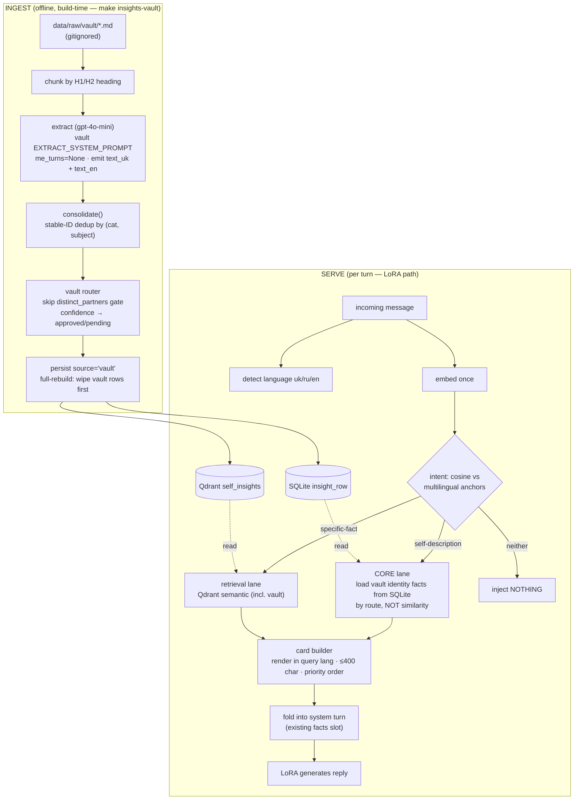

# Vault Fact Ingestion — Design Spec

**Date:** 2026-06-03
**Status:** Draft for approval
**Branch (target):** `feat/vault-fact-ingestion` (currently drafted from `feat/diagrams-excalidraw`)
**Author:** Bohdan + Claude (brainstorming)

---

## 1. Context & Goal

A drop-folder where Bohdan pastes Markdown exported from his Obsidian persona vault. On
each run the system **extracts durable persona FACTS** from those files, stores/dedupes
them, and injects a **tiny, capped, in-language fact card** into the serving system turn.

This is **FACT-grounding only**. It must NOT change writing style — style lives entirely
in the LoRA weights. Its single job: stop the bot fabricating *who Bohdan is* (where he
studies/works, who matters to him, his stable opinions).

**Governing principle:** *dump liberally → extract ruthlessly → inject tiny.* Raw file
text NEVER reaches the model.

## 2. Non-goals

- No style/voice changes (weights own voice; this owns facts).
- No volatile state, work/sprint/pipeline notes, technical project/code notes, or study
  material in the card (see §12 PUT-IN / LEAVE-OUT).
- No few-shot assistant-role examples — facts go ONLY into the system turn. Prior work
  proved extra assistant turns drag the small model back to a generic-assistant register
  (the dominant failure mode). **Preserve train==serve.**
- No manual labeling — extraction is automatic.
- No new bespoke storage — reuse the existing insights store.

## 3. Hard design rules (constraints)

1. Raw note text never reaches the model; only distilled facts do.
2. Card is tiny (≤ 400 chars), in Bohdan's language, **durable identity only**.
3. Facts enter via the existing **system-turn facts slot** only. Never as assistant turns.
4. Free/local-leaning. Serving is 100% local (LoRA). Offline pipeline may use cheap
   OpenAI in v1; full-local is Phase 3 (prod-invariant — see §4).
5. Reuse existing machinery; do not duplicate it.
6. Privacy: `raw/` folder and any extracted personal facts are gitignored; never commit
   real personal content. Committed tests use a **synthetic** fixture vault only.

## 4. The three LLM roles (mental model)

Keeping these distinct prevents the "should it be LoRA?" confusion:

| Role | Job | Model (v1 → Phase 3) | On prod serving hot path? |
|------|-----|----------------------|---------------------------|
| **Generation** | writes the reply in Bohdan's voice | LoRA → LoRA | ✅ the persona |
| **Extraction** | note prose → categorized JSON facts | gpt-4o-mini → local instruct | ❌ offline/batch ETL |
| **Embedding** | text → vector for Qdrant | text-embedding-3-small → local multilingual-e5-large | ✅ at retrieval/classification |

**Extraction is prod-invisible.** By serve time facts already live in SQLite + Qdrant;
prod reads them. So the extractor choice does not change the prod architecture — only
fact quality + ingestion cost/locality. The LoRA is the **wrong tool** for extraction (it
is de-tuned away from instruction-following; JSON extraction fights its training).
**Embedding is a prod component** (retrieve_insights embeds the incoming at serve time),
so the Phase-3 embedder swap genuinely improves prod retrieval — but it is an embedding
model, never the LoRA.

## 5. Category taxonomy — DECISION

**Vault-specific identity taxonomy: `{bio, relationship, value, opinion}`.** This is a
*separate vocabulary* used only by vault extraction; the chat pipeline keeps its existing
`{bio, opinion, interest, behavior}` untouched (zero risk to the validated chat eval).

| Category | Captures | Example (synthetic) |
|----------|----------|---------------------|
| `bio` | stable facts: live/study/work/age/languages, one-line "what I build" | "навчається на CS у Fictional State University" |
| `relationship` | people who matter + their role | "Sam — найближчий друг, з ним радиться" |
| `value` | principles, goals, what drives him | "цінує прямоту; не любить тягнути з рішеннями" |
| `opinion` | stable takes / taste | "вважає що фреймворк X переоцінений" |

**Rationale:**
- Maps 1:1 to the PUT-IN list; naturally excludes the LEAVE-OUT list (no project-tech /
  work / log category exists to land them in).
- Drops `interest` (folds into opinion/value) and `behavior` (≈ style → lives in weights,
  out of scope) — the chat scheme was tuned for chat-signal, not durable identity.
- Same count (4) as today, re-aimed at IDENTITY. Card-eligible priority: **bio >
  relationship > value > opinion**.

## 6. Architecture overview



**Why this shape (the two hard problems it solves):**
- *Vague self-queries* ("розкажи про себе") don't densely match concrete fact sentences →
  the **CORE lane reaches facts by ROUTE, not similarity**, so it works regardless of
  embedding quality.
- *"Don't bias every turn"* → the **neither → nothing** lane means grounding fires only
  when identity is actually at stake. This is NOT always-on.
- *Cross-lingual* → multilingual anchors (within-language match, fine on current embedder)
  + Phase-3 local e5 sharpen the specific-fact lane.

## 7. Data model changes

`InsightRow` (SQLModel, `persona_rag/db/models.py`):
- **Add** `text_en: str | None = None` (nullable, backward-compatible). `text` stays the
  canonical (uk for vault; original for chat). Chat rows leave `text_en` null.
- `source` gains a new value `"vault"` (column already exists: `chat|user_verified|onboarding`
  → `…|vault`). No schema change, just a new allowed value.
- Migration: `ALTER TABLE insight_row ADD COLUMN text_en` (SQLite, nullable, no backfill).

Qdrant payload + `recency.from_qdrant_point` / the retrieved-insight model: carry
`text_en` so the retrieval lane can render in en.

## 8. Phase 0 — TDD probe set & test plan (authored FIRST)

Tests are written **before** the architecture and drive it red→green. Two data sources:
- **Synthetic fixture vault** (committed, `tests/fixtures/vault/*.md`, fake facts) — the
  reproducible, privacy-safe basis for the committed test suite.
- **Real vault** (Bohdan provides the Obsidian path; pulled into the gitignored
  `data/raw/vault/`) — used only for the live faithfulness validation at the checkpoint,
  never committed.

### 8.1 Probe classes

**A. Vague self-description → must route to CORE**
`розкажи про себе` · `хто ти` · `опиши себе` · `tell me about yourself` · `who are you`
· `расскажи о себе`

**B. Specific factual → must route to retrieval lane**
`де вчишся?` · `ким працюєш?` · `where do you live?` · `хто твій найкращий друг?`

**C. Control (not identity) → must inject NOTHING**
`що по погоді` · `го грати` · `ахах да`

### 8.2 Assertions (red→green targets)

1. **Routing:** A → CORE; B → retrieval; C → none. (objective)
2. **Language:** card rendered in the query's language; uk/ru → uk text, en → text_en;
   mixed → uk. (objective)
3. **Cap:** card ≤ 400 chars; priority bio > relationship > value > opinion. (objective)
4. **Dedup idempotency:** running ingest twice → identical row set, same stable IDs, no
   duplicates; editing a note updates in place; deleting a note removes its facts
   (full-rebuild). (objective)
5. **Fact-faithfulness:** A/B replies contain the fixture's real facts; no fabricated
   identity claims (checked against a fabrication blacklist of the personality tropes the
   prompt already warns about). (semi-objective — guarded by §8.3 + real-vault check)
6. **Register invariance (the no-regression proof):** facts-off vs facts-on, `shape_js` /
   `length` / `paren_smiley` within a noise band on ALL classes. (objective,
   gaming-resistant)

### 8.3 Self-scoring honesty guard

Objective metrics (1,2,3,4,6) are gaming-resistant. Metric 5 (faithfulness) is softer and
self-authored → real guard is the **real-vault checkpoint + human eye**. The autonomous
loop may not declare "ready" on voice; that's Bohdan's call.

## 9. Phase 1 — Ingestion pipeline

**New file `persona_rag/insights/vault.py`:**
- `read_vault_files(dir) -> list[VaultDoc]` — read `*.md`/`*.txt`.
- `chunk_markdown(text) -> list[str]` — split on H1/H2; sub-split sections > ~1500 chars
  by paragraph. Each chunk → one extractor call.
- `VAULT_EXTRACT_SYSTEM_PROMPT` — a variant of `EXTRACT_SYSTEM_PROMPT`: first-person prose
  (drop Me:/Contact: + quote-attribution rules), emit the 4 identity categories, emit BOTH
  `text_uk` and `text_en` (proper nouns verbatim), skip volatile/work/tech/study content.
- `extract_vault_chunk(chunk, ...)` — reuse `chat_complete` + JSON mode; reuse
  `parse_extractor_response(text, session_id="vault:<relpath>#<i>", me_turns=None)`
  (me_turns=None skips the chat attribution check — vault prose is already first-person).
- `route_vault_insight(ci, ...)` — like onboarding: **skip the `distinct_partners` gate**;
  confidence ≥ threshold → `approved`, else `pending`.
- `persist_vault(consolidated, ...)` — write `InsightRow(source="vault")` with stable IDs
  (`_stable_insight_id`, NOT uuid4 — fixes onboarding's non-idempotency) + `text_en`;
  embed canonical `text` (uk); upsert Qdrant.
- `rebuild_vault()` — **full rebuild**: delete all `source="vault"` rows (SQLite + Qdrant)
  then re-extract from current folder contents.

**Reused as-is:** `consolidate()` (stable-ID dedup), `_stable_insight_id`,
`embed_batch`, `ensure_insights_collection`, `to_qdrant_point_id`.

**Changed:** `persistence.py` — parametrize hardcoded `source="chat"` (accept `"vault"`);
add `"vault"` to the user-touch-protected tuple so chat re-runs never clobber vault facts;
thread `text_en` into the payload.

**New script `scripts/ingest_vault.py`** + **Makefile `insights-vault`** target
(`uv run python scripts/ingest_vault.py`). Mode default: full-rebuild.

## 10. Phase 2 — Serving intent-router + language + card

**New `persona_rag/generate/lang_detect.py`:** `detect_language(text) -> "uk"|"ru"|"en"`
— Cyrillic vs Latin first; uk vs ru by distinctive chars (і/ї/є/ґ → uk). Tiny, dependency-free.

**Intent classification (in `retrieve_insights.py`, reusing the embedding it already
computes):**
- Embed a small constant set of self-description **anchor phrases** (uk+ru+en), cached.
- Cosine(incoming, anchors) ≥ `INSIGHTS_SELFDESC_ANCHOR_THRESHOLD` → `lane="self_desc"`.
- Else, if semantic retrieval yields an identity-category hit above floor → `lane="specific"`.
- Else → `lane="none"`.
- CORE loader: on `self_desc`, read `source="vault"` identity facts from SQLite ordered by
  category priority + confidence, top-N. Stash `state["insights"] = {lane, semantic, core,
  query_lang}`.

**Card builder (`prompt.py`, evolving `_compact_facts`):**
- `lane="self_desc"` → render CORE facts; `lane="specific"` → render top semantic identity
  facts (preserves existing chat-bio behavior as a subset); `lane="none"` → return None.
- Render each fact in `query_lang` (pick `text` vs `text_en`); cap 400 chars by priority.
- `build_thin_messages` / `build_messages` pass `incoming` + lane into the builder.
- Master gate stays `OLLAMA_FACTS_IN_SYSTEM`; new `INSIGHTS_FACTS_ROUTER_ENABLED`.

## 11. Phase 3 — Full-local ingestion + embedding (deferred, recommended)

Prod-relevant only for the embedder. Swap `text-embedding-3-small` →
**local `multilingual-e5-large`** (1024-dim, MIT, ~0.56 GB, via Ollama/sentence-transformers):
recreate Qdrant collection at 1024 dims, re-embed existing chat insights, re-run chat A/B
to prove no regression. Optionally swap extraction → local instruct model (prod-invariant).
This achieves true free/local and fixes the documented uk/ru↔en cross-lingual weak spot on
the specific-fact lane. Validated by its own A/B; not required for v1 to work (CORE lane is
embedding-independent).

## 12. Privacy & gitignore

**PUT IN `data/raw/vault/`:** me/identity notes (bio, live/study, values, goals,
self-description); relationships/people; stable opinions/preferences/taste; high-level
"what I'm working on" as one-line identity ("I build AI persona tools").

**LEAVE OUT:** technical project/code notes (architecture, schemas); work/sprint/pipeline/
outreach notes (volatile); gym/learning/setup logs; exam/study material.

**Gitignore (mirror the telegram/instagram convention):**
```
!data/raw/vault/
data/raw/vault/*
!data/raw/vault/.gitkeep
```
Only `.gitkeep` is committed; real notes never are. Extracted facts live in `*.db` +
`qdrant_storage/` (both already gitignored). The committed test suite uses the synthetic
fixture vault only. This design doc contains synthetic examples exclusively.

## 13. Files to add / change

**Add:**
- `persona_rag/insights/vault.py` — read/chunk/extract/route/persist/rebuild.
- `persona_rag/generate/lang_detect.py` — uk/ru/en detector.
- `scripts/ingest_vault.py` — orchestrator (full-rebuild).
- `tests/insights/test_vault_ingest.py`, `tests/generate/test_fact_router.py`,
  `tests/generate/test_lang_detect.py`, `tests/fixtures/vault/*.md` (synthetic),
  `tests/eval/test_card_register_invariance.py` (the A/B harness probes).
- `data/raw/vault/.gitkeep`.

**Change:**
- `persona_rag/db/models.py` — `InsightRow.text_en`; allow `source="vault"`.
- `persona_rag/insights/persistence.py` — `source` param; protect `vault`; payload `text_en`.
- `persona_rag/generate/prompt.py` — lane/language-aware card builder; pass `incoming`.
- `persona_rag/graph/nodes/retrieve_insights.py` — classify intent, detect lang, load CORE,
  stash in state.
- `persona_rag/insights/recency.py` — carry `text_en` through `from_qdrant_point` + model.
- `persona_rag/config.py` — new settings (§16).
- `Makefile` — `insights-vault` (+ optional `compare-vault`).
- `.gitignore` — `data/raw/vault/` lines.

## 14. A/B validation protocol (open-Q#6)

Extend the existing `compare` harness (or a focused probe runner) to run facts-OFF vs
facts-ON on the §8.1 probe set:
- **REQUIRE unchanged** (within noise band): `shape_js`, `length`, `paren_smiley` on all
  classes — proves no register regression.
- **REQUIRE improved**: self-description (class A) + specific (class B) replies become
  fact-faithful — contain the vault facts, fabrication-rate → ~0.
- Fact-faithfulness check: deterministic containment vs fixture facts + fabrication
  blacklist for the committed test; optional gpt-4o-mini judge for nuance on the real-vault
  run. Generation A/B needs llama-server up (gguf present: `models/bohdan-q5_k_m.gguf`).

## 15. Execution model (post-approval)

Worktree-isolated, autonomous-to-green, then checkpoint:
1. Spec approved → branch `feat/vault-fact-ingestion` in a git worktree.
2. **Isolation:** experiments point at an isolated Qdrant test collection + a synthetic/
   copied test DB — the real `persona.db` and `self_insights` collection are never touched.
3. **Tier 1 (autonomous):** author Phase-0 tests → build Phases 1–2 on the synthetic vault
   → drive ALL objective metrics (§8.2: routing, language, cap, dedup, register-invariance)
   to green, reporting hard scores. Improve architecture until solid.
4. **Tier 2 (checkpoint — needs Bohdan):** pull real notes from the provided vault path
   into `data/raw/vault/` → run live faithfulness + eyeball actual cards/replies → Bohdan
   gives the voice/"ready" sign-off. This seam is irreducibly human (guards against
   green-but-fake self-scoring).

## 16. Settings added (`config.py`)

- `VAULT_RAW_DIR: str = "data/raw/vault"`
- `VAULT_CONFIDENCE_THRESHOLD: float` — approved vs pending for vault routing.
- `INSIGHTS_FACTS_ROUTER_ENABLED: bool = True`
- `INSIGHTS_SELFDESC_ANCHOR_THRESHOLD: float` — cosine gate for self-description intent.
- `INSIGHTS_CORE_MAX_FACTS: int` — top-N identity facts in the CORE card.
- (existing `OLLAMA_FACTS_IN_SYSTEM` remains the master gate; existing
  `QDRANT_INSIGHTS_COLLECTION` overridable for worktree isolation.)

## 17. Alternatives considered & rejected

- **Always-on card** (inject all identity facts every turn) — biases every reply, pollutes
  context. Rejected (Bohdan's explicit objection).
- **Pure query-gated retrieval** (no router) — vague self-queries under-retrieve concrete
  facts → fabrication persists. Rejected (the original failure mode).
- **HyDE / query decomposition** — hallucination-prone on small local models, added
  latency, no recall gain for "who are you". Rejected.
- **Unified 6-category taxonomy across chat+vault** — bigger blast radius on the validated
  chat eval. Rejected for v1 (vault-specific vocab instead).
- **Dual-language storage for embedding** — 2× cost, translation can silently break
  retrieval. Rejected; dual-language is for DISPLAY only (embed uk canonical).
- **Extraction via the LoRA** — wrong tool; fights its training. Rejected (§4).

## 18. Open risks

- Specific-fact lane cross-lingual recall is weaker on `text-embedding-3-small` until
  Phase 3 — mitigated because the highest-value case (self-description) is embedding-
  independent (CORE by route).
- Anchor-threshold tuning (self_desc vs specific) may need iteration — covered by the
  autonomous loop's routing tests.
- `text_en` migration on the existing `persona.db` — additive nullable column; verify the
  app's table-creation path picks it up (or add a one-line migration).
